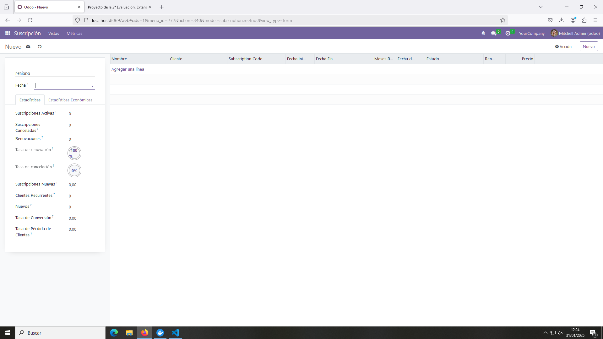
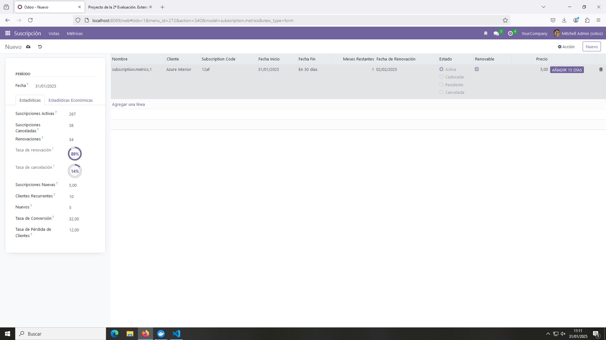

# Proyecto de la 2ª Evaluación: Extensión del modelo de suscripciones mediante métricas y estadísticas

## Modelo metrics.py

```python
# -*- coding: utf-8 -*-

from odoo import models, fields, api


class metrics(models.Model):
    _name = 'subscription.metrics'
    _description = 'subscription.metrics'

    # Campos Basicos
    fecha = fields.Date(string="Fecha")
    subs_activas = fields.Integer(string="Suscripciones Activas")
    ingresos = fields.Float(string="Ingresos")
    tasa_renovacion = fields.Float(string="Tasa de renovación",
                                   compute="_calcular_tasa_renovacion")
    tasa_cancelacion = fields.Float(string="Tasa de cancelación",
                                    compute="_calcular_tasa_cancelacion")
    nuevas_subs = fields.Float(string="Suscripciones Nuevas")
    subs_canceladas = fields.Integer(string="Suscripciones Canceladas")
    renovaciones = fields.Integer()
    recurrentes = fields.Integer(string="Clientes Recurrentes")
    nuevos = fields.Integer(string="Nuevos") 
    ingresos_promedio_usuario = fields.Integer(string="Ingresos Promedio por Usuario",
                                               compute="_calcular_ingreso_promedio_por_usuario")
    tasa_conversion = fields.Float(string="Tasa de Conversión")
    tasa_perdida_clientes = fields.Float(string="Tasa de Pérdida de Clientes")
    lifetime_value = fields.Float(string="Ingresos Totales por Usuario")
    costo_adquisicion = fields.Float(string="Coste de Adquisición")
    notas = fields.Text(string="Notas")
    subs = fields.One2many(
        comodel_name = 'subscription.subscription',
        inverse_name = 'name',
        string = 'Suscripciones')

    @api.depends('renovaciones', 'subs_canceladas')
    def _calcular_tasa_renovacion(self):
        for sub in self:
            sub.tasa_renovacion = ((sub.renovaciones / sub.subs_canceladas) if sub.subs_canceladas != 0 else -1) * 100

    @api.depends('subs_canceladas', 'subs_activas')
    def _calcular_tasa_cancelacion(self):
        for sub in self:
            sub.tasa_cancelacion = (sub.subs_canceladas / (sub.subs_activas if sub.subs_activas != 0 else 1)) * 100

    @api.depends('ingresos', 'subs_activas')
    def _calcular_ingreso_promedio_por_usuario(self):
        for sub in self:
            sub.ingresos_promedio_usuario = (sub.ingresos / sub.subs_activas) if sub.subs_activas != 0 else -1
```

## Vista metrics_views.xml

```xml
<odoo>
  <data>
    <!-- explicit list view definition -->

    <record model="ir.ui.view" id="subscription.form_metrics">
      <field name="name">subscription list</field>
      <field name="model">subscription.metrics</field>
      <field name="arch" type="xml">
        <form string='Métricas'>
          <sheet>
              <group string="Período">
                <field name="fecha"/>
            </group>
            <notebook>
              <page name="estadisticas" string="Estadísticas">
              <group>
                  <field name="subs_activas"/>
                  <field name="subs_canceladas"/>
                  <field name="renovaciones"/>
                  <field name="tasa_renovacion" widget="percentpie"/>
                  <field name="tasa_cancelacion" widget="percentpie"/>
                  <field name="nuevas_subs"/>
                  <field name="recurrentes"/>
                  <field name="nuevos"/>
                  <field name="tasa_conversion"/>
                  <field name="tasa_perdida_clientes"/>
                </group>
              </page>

              <page name="economia" string="Estadísticas Económicas">
                <group>
                  <field name="ingresos"/>
                  <field name="ingresos_promedio_usuario"/>
                  <field name="lifetime_value"/>
                  <field name="costo_adquisicion"/>
                  <field name="notas"/>
                </group>
              </page>
            </notebook>
          </sheet>
          <field name="subs"/>
        </form>
      </field>
    </record>
  </data>
</odoo>
```

## Fichero menu_views.xml

```xml
<odoo>
  <data>
    <!-- actions opening views on models -->

    <record model="ir.actions.act_window" id="subscription.action_window_basic">
      <field name="name">Gestión de Suscripción</field>
      <field name="res_model">subscription.subscription</field>
      <field name="view_mode">tree,form</field>
      <field name="view_id" ref="subscription.list_basic"/>
    </record>

    <record model="ir.actions.act_window" id="subscription.action_window_usage">
      <field name="name">Gestión de Suscripción</field>
      <field name="res_model">subscription.subscription</field>
      <field name="view_mode">tree,form</field>
      <field name="view_id" ref="subscription.list_usage"/>
    </record>

    <record model="ir.actions.act_window" id="subscription.action_window_form">
      <field name="name">Gestión de Suscripción</field>
      <field name="res_model">subscription.subscription</field>
      <field name="view_mode">tree,form</field>
      <field name="view_id" ref="subscription.form"/>
    </record>

    <record model="ir.actions.act_window" id="subscription.action_window_metrics">
      <field name="name">Estadísticas</field>
      <field name="res_model">subscription.metrics</field>
      <field name="view_mode">form</field>
    
    </record>


    <!-- Top menu item -->

    <menuitem name="Suscripción" id="subscription.menu_root"/>

    <!-- menu categories -->

    <menuitem name="Vistas" id="subscription.menu_1" parent="subscription.menu_root"/>
    <menuitem name="Métricas" id="subscription.menu_2" parent="subscription.menu_root"/>

    <!-- actions -->

    <menuitem name="Vista Básica" id="subscription.menu_1_list" parent="subscription.menu_1"
              action="subscription.action_window_basic"/>
    
    <menuitem name="Vista de Uso" id="subscription.menu_2_list" parent="subscription.menu_1"
              action="subscription.action_window_usage"/>

    <menuitem name="Vista de Formulario" id="subscription.menu_3_list" parent="subscription.menu_1"
              action="subscription.action_window_form"/>

    <menuitem name="Métricas" id="subscription.menu_4_list" parent="subscription.menu_2"
              action="subscription.action_window_metrics"/>
    
  </data>
</odoo>
```

## Fichero manifest.py

```python
# -*- coding: utf-8 -*-
{
    'name': "subscription",

    'summary': """
        Short (1 phrase/line) summary of the module's purpose, used as
        subtitle on modules listing or apps.openerp.com""",

    'description': """
        Long description of module's purpose
    """,

    'author': "My Company",
    'website': "https://www.yourcompany.com",

    # Categories can be used to filter modules in modules listing
    # Check https://github.com/odoo/odoo/blob/16.0/odoo/addons/base/data/ir_module_category_data.xml
    # for the full list
    'category': 'Uncategorized',
    'version': '0.1',

    # any module necessary for this one to work correctly
    'depends': ['base'],

    # always loaded
    'data': [
        'security/ir.model.access.csv',
        'views/basic_view.xml',
        'views/usage_view.xml',
        'views/form_view.xml',
        'views/menu_view.xml',
        'views/static_web.xml',
        'views/metric_views.xml'
    ]
}
```

## Fichero security

```csv
id,name,model_id:id,group_id:id,perm_read,perm_write,perm_create,perm_unlink
access_subscription_subscription,subscription.subscription,model_subscription_subscription,base.group_user,1,1,1,1
access_subscription_metrics,subscription.metrics,model_subscription_metrics,base.group_user,1,1,1,1
```

## Funcionamiento


Vista sin datos introducidos.

En esta vista se asigna un número negativo cuando no hay datos para la tasa de renovación.


Vista con datos introducidos.