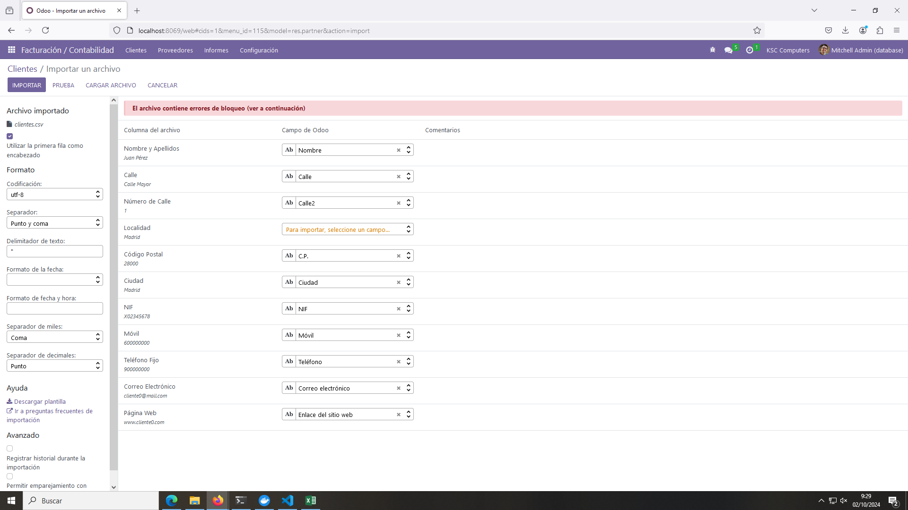

# Pr0301 : Facturas con Odoo

### 1.- Crear Empresa
Para crear una empresa con nuestros datos hacemos click en la esquina superior izquierda, sobre icono de los cuadrados y vamos a ajustes. Ahí está el tercer apartado, "Compañías", donde podemos hacer click en actualizar información y empezar a meter nuestros datos.

Esto es porque ya tenemos los datos de la demo de Odoo. En el caso de que no fuera así tendríamos que ir a Ajustes > Gestionar Compañías > Añadir Nuevo. Y completar el mismo formulario.

### 2.- Crear un Usuario con Permisos
Desde la pantalla de ajustes podemos ir directamente al apartado de "Usuarios y Compañías" y hacemos click en Usuarios. Hacemos click en "Nuevo" y rellenamos los datos como sea conveniente.

Para darle permisos al módulo de Facturación debemos bajar un poco, y en el apartado de Contabilidad hacemos click en el desplegable y asignamos Facturación.

Es importante destacar que este usuario no tendrá acceso al sistema hasta que no le asignamos una contraseña. Para ello, vamos al apartado "Acción" en la parte superior derecha y hacemos click en "Asignar contraseña".

Ahora podemos acceder a este usuario con el mail y contraseña que le hayamos asignado y solo tendrá acceso al módulo Facturación.

### 3.- Cambiar la Aparaciencia de las Facturas
Tenemos que dirigirnos al módulo de Facturación con un usuario que tenga el permiso para modificar el diseño de las facturas. El usuario anteriormente creado no debería tener este permiso.

Hacemos click en Personalizar y aparecerá un menú con todas las opciones. Modificamos como queramos; En mi caso he dejado los botones azul y negro, he puesto un fondo "Geométrico" y una imagen como logo. En el caso de que a la hora de crear nuestra compañía ya hubiéramos asignado un logo este vendrá por defecto.

De igual manera podemos hacer estos pasos desde Ajustes > Opciones Generales > Compañías > Configurar Diseño del Documento.

Para poner el QR desde Ajustes > Facturación, bajamos hasta el apartado Pagos de Cliente y marcamos la opción "Códigos QR".

### 4.- Cargar datos desde un CSV
Vamos al módulo de Facturación > Clientes y sobre el botón "Favoritos" hacemos click en "Importar Registros". Nos llevará a otra página donde podremos importar todos los clientes desde un archivo csv.

Nos pedirá que configuremos que datos son cuáles y asignaremos los que creamos convenientes.

Hacemos click en Importar y se importarán todos los clientes.

### 5.- Generar Facturas
Iniciamos sesión con el usuario creado en el apartado 2 y vamos al módulo de Facturación. Hacemos click en "Nuevo" y nos saldrá el menú para crear una nueva factura.

Seleccionamos un cliente, hacemos click en "Agregar Línea" y seleccionamos un producto. Adicionalmente podemos añadir otros términos como pagos en un tiempo máximo, fecha de vencimiento, etc.

Hacemos click en "Confirmar" y en "Enviar e Imprimir". Y generamos [nuestra factura](./INV_2024_00005.pdf).