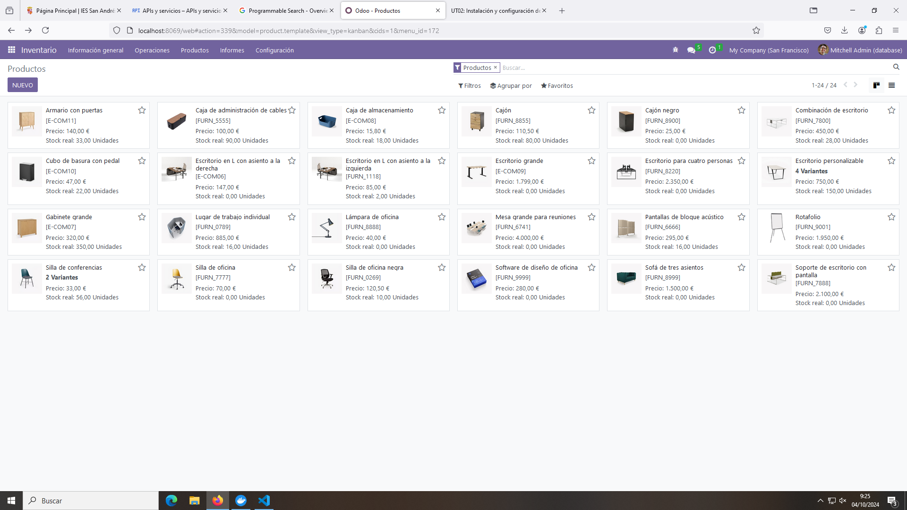
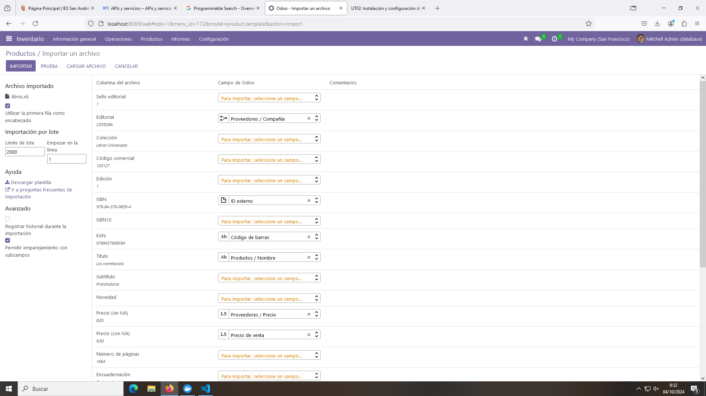
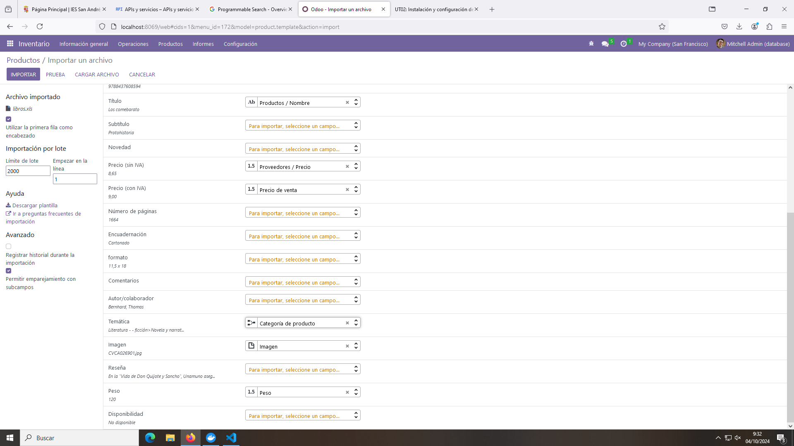
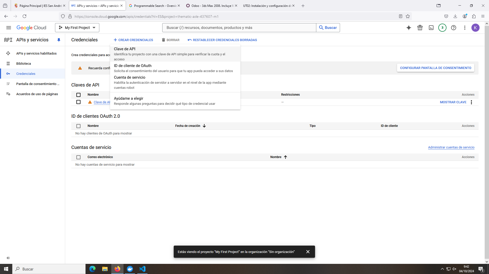
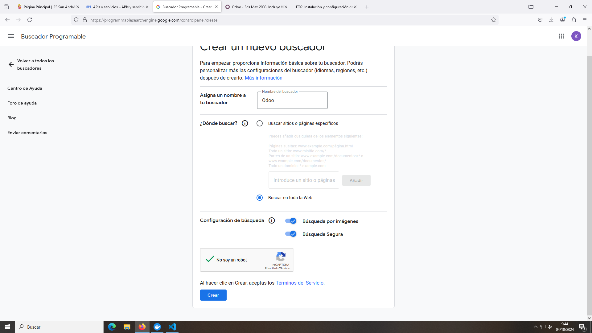
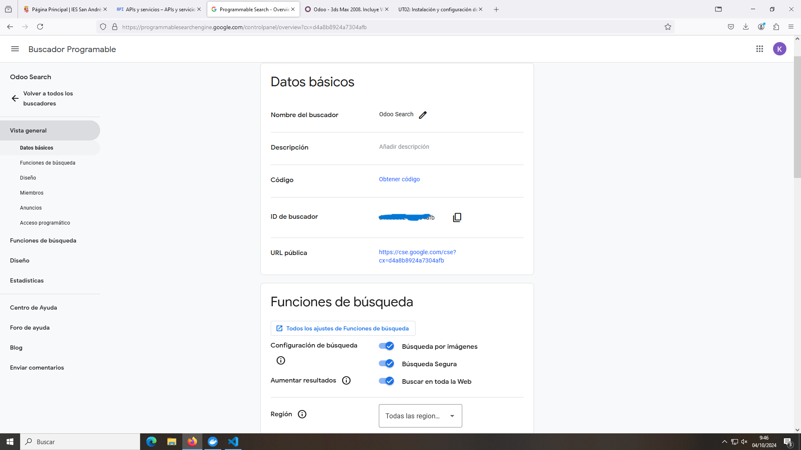
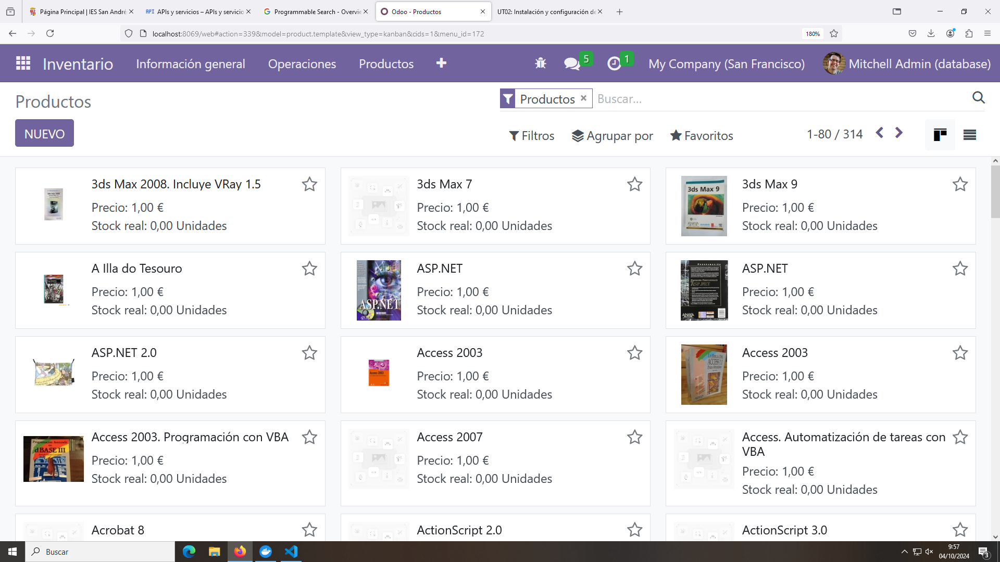

# Pr0302 : Integración de Servicios Externos

### 1.- Activar el Módulo Inventario

Para activar el módulo "Inventario" nos dirigimos al apartado de **Aplicaciones**, buscamos el módulo y hacemos click en **Activar**.

En cuanto se active podremos acceder a él.

### 2.- Cargar Inventario Desde un Archivo
Vamos al módulo de **Inventario** y en la parte superior hacemos click en **Productos**. Aquí se cargarán todos los productos que existen actualmente en nuestro inventario. (En mi caso aparecen muebles porque cargué la versión demo de Odoo.)

Para cargar los productos desde el archivo hacemos click en **Favoritos** > **Importar Registros**. Igual que con los clientes, se nos abrirá un menú en el que podemos subir nuestro archivo con los productos. Hacemos click en **Subir Archivo** y seleccionamos el archivo.

Ahora debemos configurar todos los campos para que se correspondan con los que nos interesan en nuestro módulo de Inventario.

Hay muchos campos que no tenemos por defecto en el módulo Inventario, así que he asignado los principales (título, código de barras, precio...) y alguno adicional.

El apartado de imagen tendremos que desactivarlo porque nos dará un error (y vamos a buscarlas después).

En cuanto hayamos configurado la importación hacemos click en **Importar** en la parte superior izquierda y nuestros productos se cargarán.

### 3.- Buscar Imágenes con la API de Google
Para buscar imágenes vamos a utilizar una API de google que lo buscará automáticamente por nosotros. Para ellos debemos buscar la API [Custom Search API ](https://console.cloud.google.com/apis/api/customsearch.googleapis.com/metrics?hl=ES&project=thematic-axle-437607-m1). Nos tendremos que loggear con nuestra cuenta de Google y, una vez hecho eso, hacemos click en el botón **Habilitar**.

Después tendremos que irnos al apartado "Credenciales" en la parte izquierda y hacer click sobre el botón **Crear Credenciales** > **Clave de API** en la parte de arriba.

Se generará una clave (que debería ser privada) en nuestra lista de claves de APIs.

Después tenemos que configurar el buscador [Programmable Search Engine](https://programmablesearchengine.google.com/about/). En el link hacemos click en el botón "Get Started" y nos saltará un menú para configurar nuestro motor de búsqueda.

Es importante marcar **Buscar en toda la web** y activar la **Búsqueda por imágenes**. También es recomendable marcar la "Busqueda Segura".

Cuando tengamos todo configurado hacemos click en **Crear** (y nos aseguramos de no ser un robot).

Se generará una lista con un motor (si es la primera vez que hacemos esto) y si entramos veremos un menú con las diferentes opciones.

Lo importante de aquí es copiar la ID del buscador (que también debería ser privada).

Ahora debemos volver a **Odoo** > **Ajustes** > **Opciones Generales** > Bajar hasta **Integraciones** y marcamos la opción **Google Imágenes**. Nos pedirá que guardemos la configuración y recarguemos la página. Lo hacemos, volvemos a bajar y habrán aparecido dos nuevos campos; **Clave API** y **ID de Motor de Búsqueda**.

En Clave API pegamos la clave que generamos anteriormente en la página de APIs de Google y en ID Motor de Búsqueda pegamos la ID que acabamos de generar en el paso anterior.

Ahora podemos ir a nuestro módulo de **Inventario** > **Productos** y hacer click en cualquiera de ellos. En el menú del producto hacemos click en **Acción** > **Obtener Imágenes de Google Imágenes** > **Obtener Imágenes**. (Realmente se puede hacer con todos los productos, pero el motor de búsqueda tiene un límite de 100 búsquedas en su versión gratuita, así que yo lo hago uno a uno). 

Repetimos esto con el número de productos que nosotros queramos.

Y con esto ya podemos buscar imágenes de productos de forma automática.