# PR0302: Creación y Restauración de Copia de Seguridad

### 1.- Hacer la Copia de Seguridad desde Terminal
Para hacer la copia de seguridad debemos iniciar los contenedores como hacemos normalmente.

Una vez hecho esto ejecutamos el comando:

`docker compose exec db bash`

Donde 'db' es el nombre del contenedor. Este comando nos conectará al contenedor de la base de datos en un bash para poder escribir comandos.

Lo siguiente es ejecutar el comando:

`pg_dump -U nombreUsuarioDB nombreDB > nombreArchivo.sql`

El nombreUsuario es el nombre del usuario de la base de datos, que estará reflejado en el archivo .yml con el que levantamos los contenedores.

El nombreDB es el nombre que le diéramos a la base de datos, que podemos consultar con el comando `psql -U odoo -l`.

'>' Crea un archivo donde queramos y el nombreArchivo es el nombre que le queramos dar con la extensión sql, ya que es una base de datos sql.

En mi caso el comando completo sería `pg_dump -U odoo database > backup.sql`. Una vez ejecutado se creará un archivo en la ruta y con el nombre especificado. En este caso se creará en el directorio en el que estábamos, que era el raíz. Si hacemos un `ls` podremos ver el archivo.

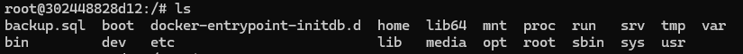

### 2.- Sacando la Copia del Contenedor a la Máquina Física desde Terminal
Ahora tenemos que sacar el archivo que hemos creado a la máquina física, ya que si borramos el contenedor perderemos todo su contenido, incluída la copia de seguridad. Para ello salimos del contenedor con `exit` y utilizamos el comando:

`docker cp contenedor:rutaArchivoContenedor rutaArchivoMaquinaFisica`

Contenedor es el código del contenedor (esa sucesión de letras y números que lo identifican). Podemos copiarlo desde Docker o escribir unos cuantos caracteres.

RutaArchivo es la ruta donde hayamos creado el archivo en el contenedor y el nombre del archivo. En nuestro caso es en el directorio raíz (`/backup.sql`).

RutaArchivoMaquinaFisica es donde se va a copiar ese archivo en nuestro ordenador. Yo estoy en el directorio que me interesa, así que escribo `.`, pero puede ser cualquier ruta.

El comando completo que he usado es:

`docker cp 3024488:/backup.sql .`

Esto crea el archivo en la ruta indicada:

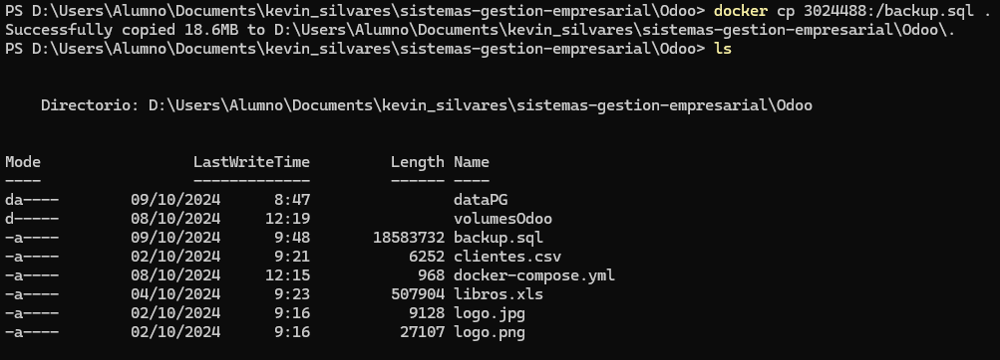
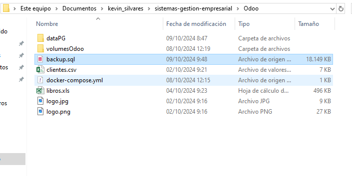

### 3.- Restauración de la Copia de Seguridad desde Terminal
Podemos borrar los contenedores de docker y borramos el interior de las carpetas dataPG y volumesOdoo.

Una vez hecho esto, volvemos a iniciar nuestros contenedores con el archivo `.yml` de las anteriores prácticas y tendremos unos contenedores vacíos.

Cuando se creen los contenedores tendremos que hacer el paso inverso y copiar el archivo backup.sql al contenedor de la base de datos. Para ello usamos el comando:

`docker cp rutaArchivo contenedor:rutaDentroDelContenedor`

En mi caso ya estoy posicionado en la terminal en el directorio donde está el archivo, así que el comando queda:

`docker cp .backup.sql d68aa:/`

Nos tenemos que conectar al contenedor con el comando `docker compose exec db bash` una vez más y si ejecutamos `ls` veremos que el arhivo existe.

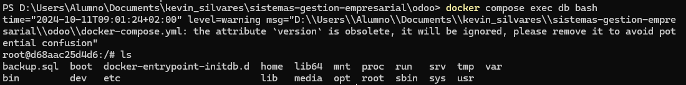

Lo siguiente es crear otra base de datos con el comando:

`createdb -U nombreUsuarioDB -O nombrePropietarioDB NombreDB`

En mi caso queda así:

`createdb -U odoo -O odoo odoo`

Posteriormente solo queda cargar el archivo sql que tenemos en la máquina con el comando:

`psql -U usuarioDB nombreDB < archivo.sql`

El caracter `<` en linux copia el contenido del archivo que lo sigue sobre lo que haya delante de él, que es justo lo que queremos.

Mi comando queda así:

`psql -U odoo odoo < backup.sql`

Saldrán muchas líneas de SQL que significan que se están ejecutando en la base de datos. Si volvemos sobre nuestras carpetas dataPG y volumesOdoo volveremos a ver contenido.

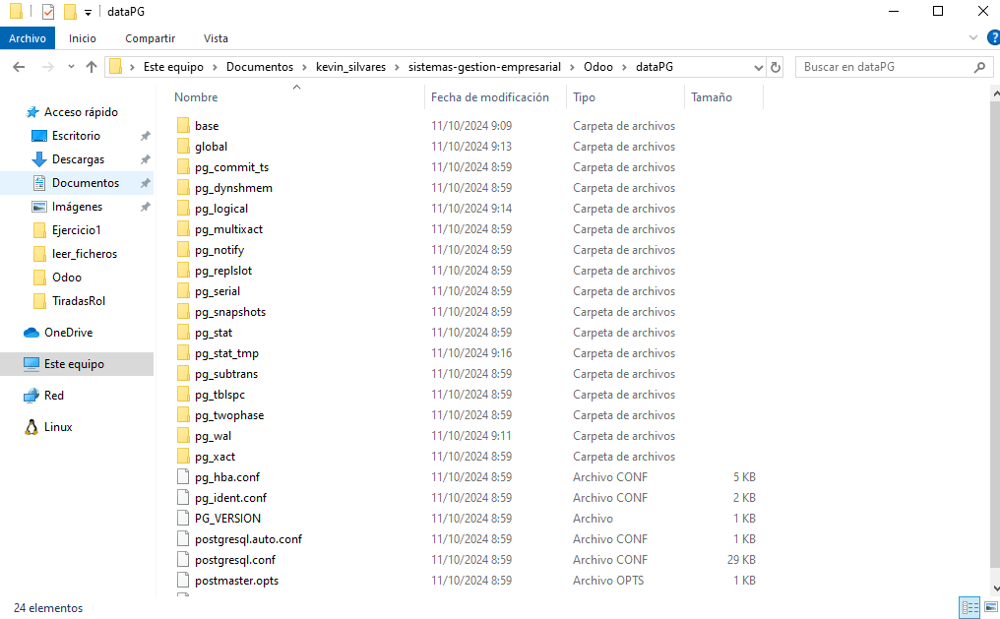
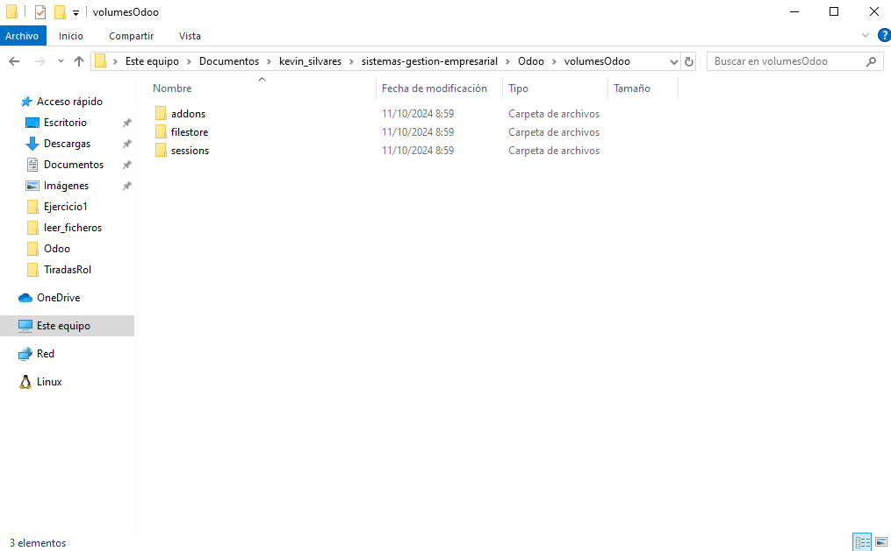

Si hemos hecho los pasos correctamente y volvemos a entrar en Odoo nada debería haber cambiado.

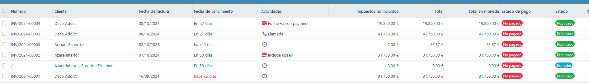
(Apartado de facturas como ejemplo)

### 4.- Creacion de Copia de Segridad desde la Interfaz Gráfica

Para hacer la copia de seguridad desde la interfaz gráfica de Odoo en nuestro navegador vamos a http://localhost:8069/web/database/manager.

Este enlace nos lleva al gestor de bases de datos dentro de Odoo.

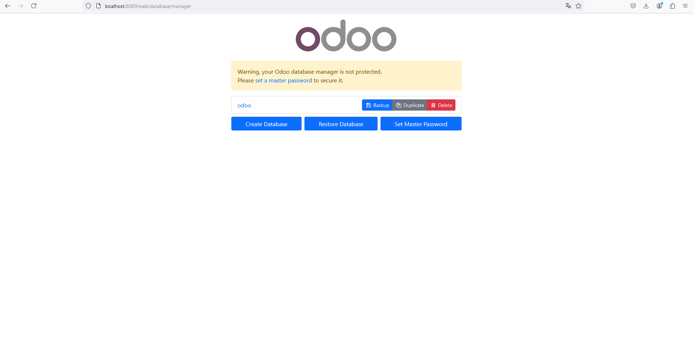

Ahora mismo solo tenemos la base de datos que acabamos de cargar. Para descargarla simplemente le damos al botón de **Backup**.

Se nos abrirá el siguiente cuadro con la contraseña y el formato de descarga.

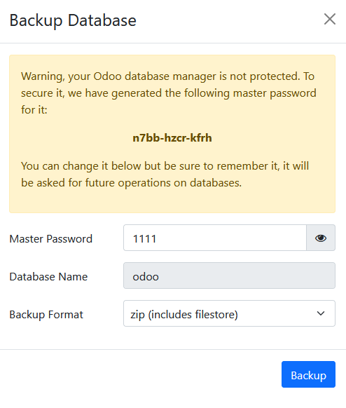

En mi caso la voy a descargar como .zip para cargarla directamente sobre Odoo. Si le damos al botón Backup descargamos la copia de la base de datos. 

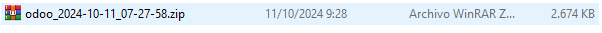

Podemos volver a parar los contenedores y los eliminamos de nuevo. Otra vez más, eliminamos el contenido de las carpetas dataPG y volumesOdoo.
Volvemos a hacer `docker compose up` con nuestro archivo `.yml`.

Volveremos a tener una instalación limpia. Para cargar la base de datos nos vamos a Odoo y nos pedirá que nos registremos, ya que no tiene ningún dato.

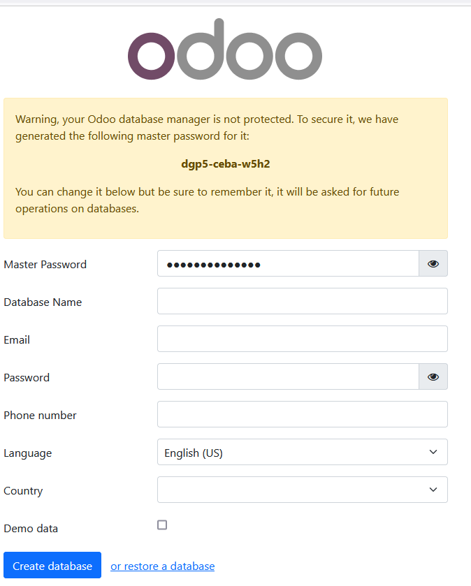

En la parte inferior, hacemos click en el botón **or restore a database** y se nos abrirá otro panel como el último.

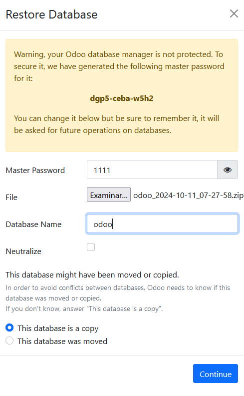

Cargamos el `.zip` (**SIN EXTRAER**) y configuramos el resto de parámetros como queramos y le damos a **Continue**.

Tardará un rato en cargar y cuando termine nos saltará el gestor de bases de datos de Odoo otra vez.

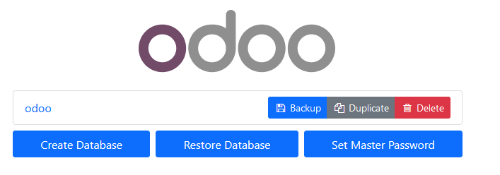

Con esto ya tenemos nuestra base de datos cargada una vez más.

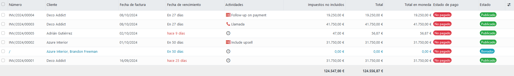
(Apartado de facturas como ejemplo)