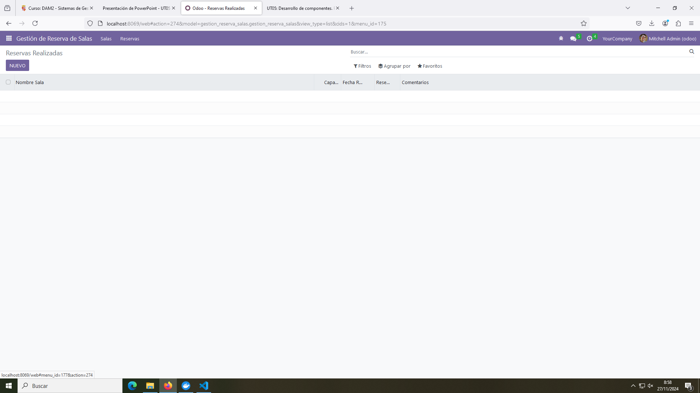
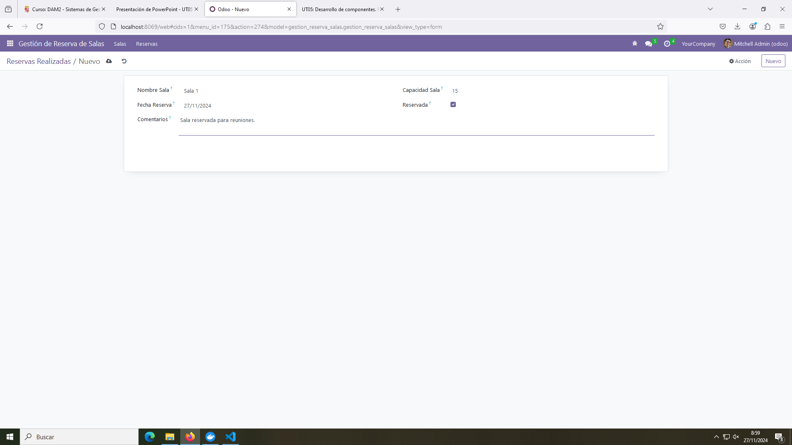
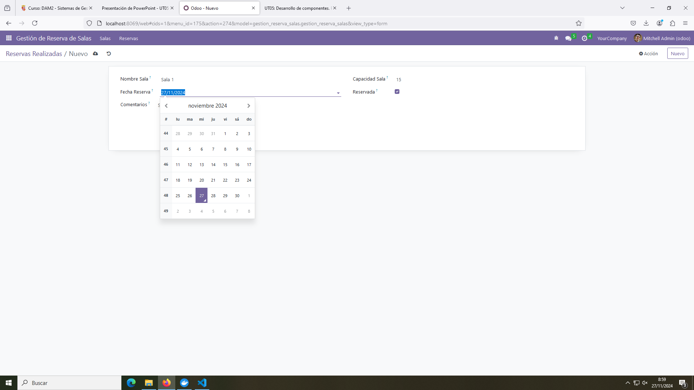
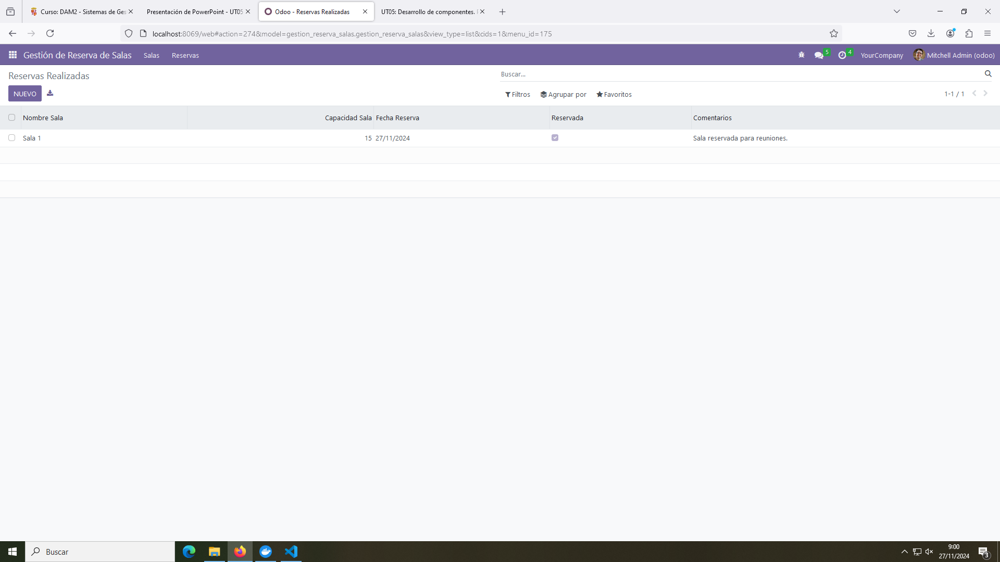

# Pr0501: Desarrollo de componentes. Primer módulo

## Archivo model.py

Contiene los campos que se han de completar para registrar una reserva de una sala en el módulo (Nombre de la sala, Capacidad de la sala, Fecha de reserva, si está reservada o no, Comentarios).

```python
# -*- coding: utf-8 -*-

from odoo import models, fields, api


class gestion_reserva_salas(models.Model):
    _name = 'gestion_reserva_salas.gestion_reserva_salas'
    _description = 'gestion_reserva_salas.gestion_reserva_salas'

    nombre_sala = fields.Char()
    capacidad_sala = fields.Integer()
    fecha_reserva = fields.Date()
    reservada = fields.Boolean()
    comentarios = fields.Text()

#     @api.depends('value')
#     def _value_pc(self):
#         for record in self:
#             record.value2 = float(record.value) / 100
```

## Archivo __manifest.py

Esencialmente se ha dado acceso al archivo `security/ir.model.access.csv` en `data`.

```python
# -*- coding: utf-8 -*-
{
    'name': "gestion_reserva_salas",

    'summary': """
        Short (1 phrase/line) summary of the module's purpose, used as
        subtitle on modules listing or apps.openerp.com""",

    'description': """
        Long description of module's purpose
    """,

    'author': "My Company",
    'website': "https://www.yourcompany.com",

    # Categories can be used to filter modules in modules listing
    # Check https://github.com/odoo/odoo/blob/16.0/odoo/addons/base/data/ir_module_category_data.xml
    # for the full list
    'category': 'Uncategorized',
    'version': '0.1',

    # any module necessary for this one to work correctly
    'depends': ['base'],

    # always loaded
    'data': [
        'security/ir.model.access.csv',
        'views/views.xml',
        'views/templates.xml',
    ],
    # only loaded in demonstration mode
    'demo': [
        'demo/demo.xml',
    ],
}
```

## Archivo views.xml

Contiene la parte visual del módulo (campos, menús y submenús).

```xml
<odoo>
  <data>
    <!-- explicit list view definition -->

    <record model="ir.ui.view" id="gestion_reserva_salas.list">
      <field name="name">gestion_reserva_salas list</field>
      <field name="model">gestion_reserva_salas.gestion_reserva_salas</field>
      <field name="arch" type="xml">
        <tree>
          <field name="nombre_sala"/>
          <field name="capacidad_sala"/>
          <field name="fecha_reserva"/>
          <field name="reservada"/>
          <field name="comentarios"/>
        </tree>
      </field>
    </record>


    <!-- actions opening views on models -->

    <record model="ir.actions.act_window" id="gestion_reserva_salas.action_window">
      <field name="name">Reservas Realizadas</field>
      <field name="res_model">gestion_reserva_salas.gestion_reserva_salas</field>
      <field name="view_mode">tree,form</field>
    </record>


    <!-- server action to the one above -->
<!--
    <record model="ir.actions.server" id="gestion_reserva_salas.action_server">
      <field name="name">gestion_reserva_salas server</field>
      <field name="model_id" ref="model_gestion_reserva_salas_gestion_reserva_salas"/>
      <field name="state">code</field>
      <field name="code">
        action = {
          "type": "ir.actions.act_window",
          "view_mode": "tree,form",
          "res_model": model._name,
        }
      </field>
    </record>
-->

    <!-- Top menu item -->

    <menuitem name="Gestión de Reserva de Salas" id="gestion_reserva_salas.menu_root"/>

    <!-- menu categories -->

    <menuitem name="Salas" id="gestion_reserva_salas.menu_1" parent="gestion_reserva_salas.menu_root"/>
    <menuitem name="Reservas" id="gestion_reserva_salas.menu_2" parent="gestion_reserva_salas.menu_root"/>


    <!-- actions -->

    <menuitem name="Salas Disponibles" id="gestion_reserva_salas.menu_1_list" parent="gestion_reserva_salas.menu_1"
              action="gestion_reserva_salas.action_window"/>

    <menuitem name="Reservas Realizadas" id="gestion_reserva_salas.menu_2_list" parent="gestion_reserva_salas.menu_2"
              action="gestion_reserva_salas.action_window"/>

  </data>
</odoo>
```

## Funcionamiento


Módulo vacío con los menús y submenús a la vista.


Apartado para reservar la sala.



Calendario desplegado para fijar una fecha para la reunión.



Módulo con la sala registrada como se ve en las capturas anteriores.