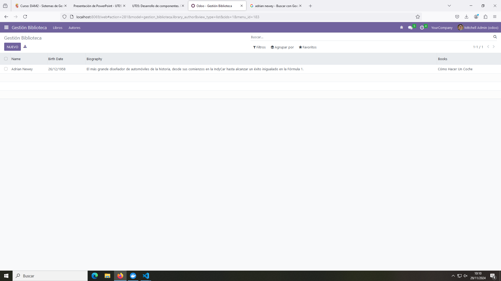

# Pr0502: Módulo de Biblioteca

En esta práctica se desarrolla un módulo para gestionar una serie de libros y autores con 2 modelos.

## Modelos

### Archivo library_books.py

Gestiona el modelo para la información de los libros.

```python
# -*- coding: utf-8 -*-

from odoo import models, fields, api


class library_author(models.Model):
    _name = 'gestion_biblioteca.library_author'
    _description = 'gestion_biblioteca.library_author'

    name = fields.Char()
    birth_date = fields.Date()
    biography = fields.Text()
    books = fields.Text()
```

### Archivo library_authors.py

Gestiona el modelo para la información de los autores.

```python
# -*- coding: utf-8 -*-

from odoo import models, fields, api


class library_book(models.Model):
    _name = 'gestion_biblioteca.library_book'
    _description = 'gestion_biblioteca.library_book'

    name = fields.Char()
    author = fields.Char()
    publishing_date = fields.Date()
    isbn = fields.Text()
    description = fields.Text()

```

### Archivo __init.py

Importa los dos modelos anteriores.

```python
# -*- coding: utf-8 -*-

from . import library_author
from . import library_book
```

## Vistas / Views

### Archivo library_menu_views.xml

Gestiona la vista de los menús.

```xml
<odoo>
  <data>
    <!-- actions opening views on models -->
    <record model="ir.actions.act_window" id="gestion_biblioteca.action_books">
      <field name="name">Gestión Biblioteca</field>
      <field name="res_model">gestion_biblioteca.library_book</field>
      <field name="view_mode">tree,form</field>
    </record>

    <record model="ir.actions.act_window" id="gestion_biblioteca.action_authors">
      <field name="name">Gestión Biblioteca</field>
      <field name="res_model">gestion_biblioteca.library_author</field>
      <field name="view_mode">tree,form</field>
    </record>


    <!-- Top menu item -->

    <menuitem name="Gestión Biblioteca" id="gestion_biblioteca.menu_root"/>

    <!-- menu categories -->

    <menuitem name="Libros" id="gestion_biblioteca.menu_1" parent="gestion_biblioteca.menu_root"/>
    <menuitem name="Autores" id="gestion_biblioteca.menu_2" parent="gestion_biblioteca.menu_root"/>

    <!-- actions -->

    <menuitem name="Lista Libros" id="gestion_biblioteca.menu_1_list" parent="gestion_biblioteca.menu_1"
              action="gestion_biblioteca.action_books"/>
    <menuitem name="Lista Autores" id="gestion_biblioteca.menu_2_list" parent="gestion_biblioteca.menu_2"
              action="gestion_biblioteca.action_authors"/>

  </data>
</odoo>
```

### Archivo library_books_views.xml

Gestiona la vista de los libros.

```xml
<odoo>
  <data>
    <!-- explicit list view definition -->

    <record model="ir.ui.view" id="gestion_biblioteca.list_books">
      <field name="name">Libros</field>
      <field name="model">gestion_biblioteca.library_book</field>
      <field name="arch" type="xml">
        <tree>
          <field name="name"/>
          <field name="author"/>
          <field name="publishing_date"/>
          <field name="isbn"/>
          <field name="description"/>
        </tree>
      </field>
    </record>

  </data>
</odoo>
```

### Archivo library_authors_views.xml

Gestiona la vista de los autores.

```xml
<odoo>
  <data>
    <!-- explicit list view definition -->

    <record model="ir.ui.view" id="gestion_biblioteca.list_authors">
      <field name="name">Autores</field>
      <field name="model">gestion_biblioteca.library_author</field>
      <field name="arch" type="xml">
        <tree>
          <field name="name"/>
          <field name="birth_date"/>
          <field name="biography"/>
          <field name="books"/>
        </tree>
      </field>
    </record>

  </data>
</odoo>
```

## Archivos de configuración

Una vez definidos los ficheros anteriores es necesario tanto importarlos en el archivo __manifest.py__ en el apartado _data_ y configurar sus permisos en el fichero __ir.model.access.csv__.

### Fichero __manifest.py

```python
# -*- coding: utf-8 -*-
{
    'name': "gestion_biblioteca",

    'summary': """
        Short (1 phrase/line) summary of the module's purpose, used as
        subtitle on modules listing or apps.openerp.com""",

    'description': """
        Long description of module's purpose
    """,

    'author': "My Company",
    'website': "https://www.yourcompany.com",

    # Categories can be used to filter modules in modules listing
    # Check https://github.com/odoo/odoo/blob/16.0/odoo/addons/base/data/ir_module_category_data.xml
    # for the full list
    'category': 'Uncategorized',
    'version': '0.1',

    # any module necessary for this one to work correctly
    'depends': ['base'],

    # always loaded
    # AQUI SE CARGAN LAS VISTAS Y EL FICHERO ACCES.CSV
    'data': [
        'security/ir.model.access.csv',
        'views/library_menu_views.xml',
        'views/library_books_views.xml',
        'views/library_authors_views.xml',
        'views/templates.xml',
    ],
    # only loaded in demonstration mode
    'demo': [
        'demo/demo.xml',
    ],
}
```

### Fichero ir.model.access.csv

```csv
id,name,model_id:id,group_id:id,perm_read,perm_write,perm_create,perm_unlink
access_gestion_biblioteca_library_authors,gestion_biblioteca.library_authors,model_gestion_biblioteca_library_author,base.group_user,1,1,1,1
access_gestion_biblioteca_library_books,gestion_biblioteca.library_books,model_gestion_biblioteca_library_book,base.group_user,1,1,1,1
```

## Funcionamiento


Módulo vacío.


Apartado añadir un libro.


Libro añadido desde la vista de Lista de Libros.


Apartado Lista Autores vacío.


Apartado añadir autor.


Autor añadido desde la vista de Lista de Autores