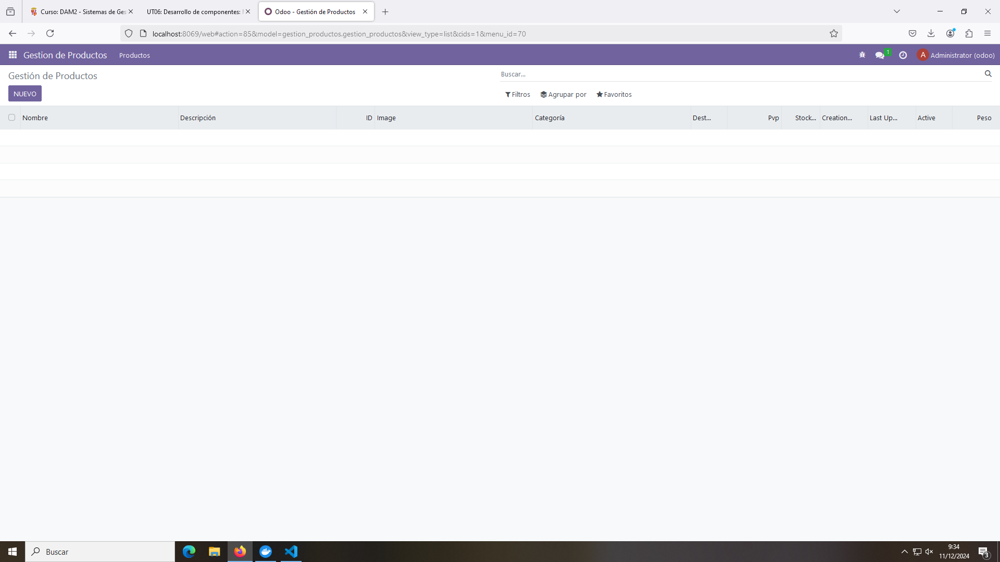
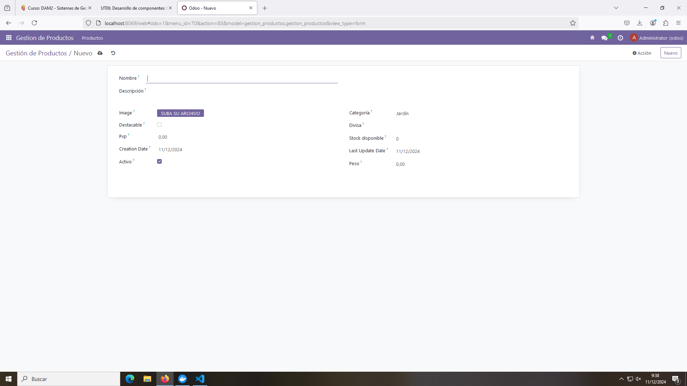
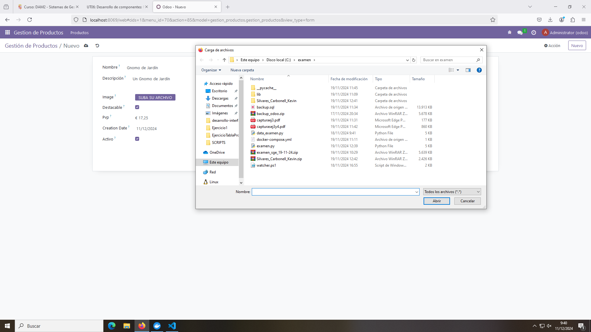
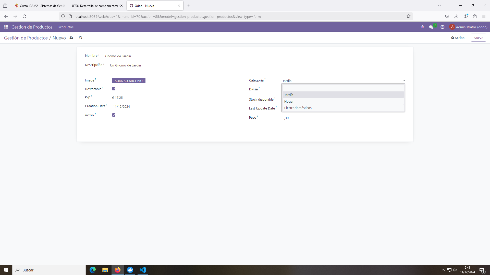
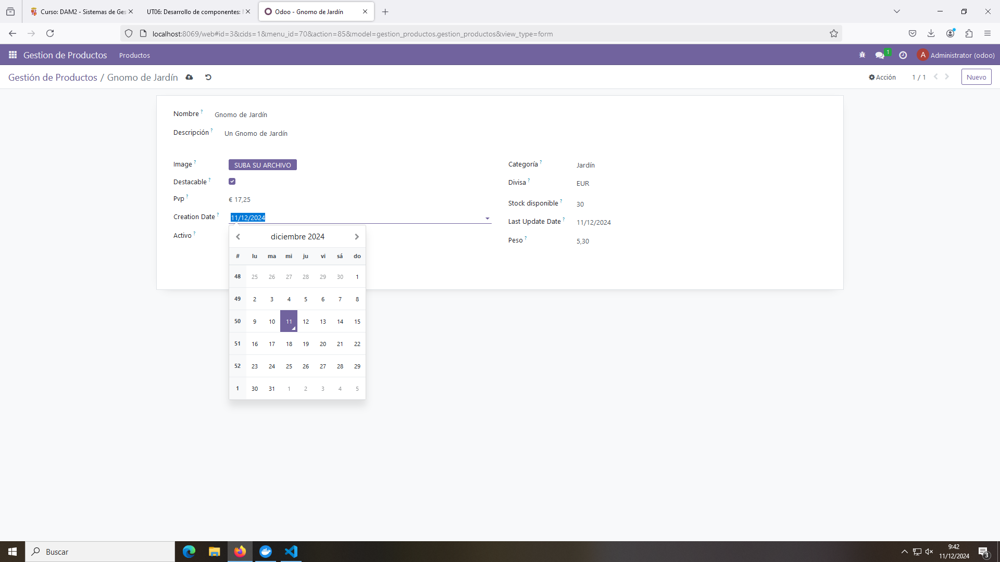
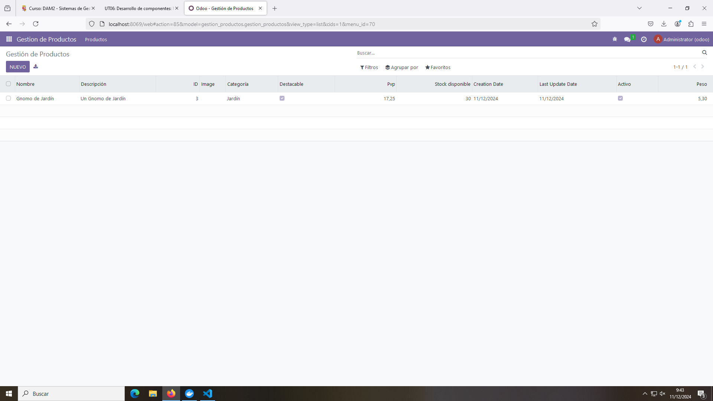

# PR0601: Campos del Modelo - Gestión de Productos

En esta práctica se desarrolla un módulo para la Gestión de Productos con diferentes campos.

## Modelo

El archivo del modelo queda así:

```python
# -*- coding: utf-8 -*-

from odoo import models, fields, api


class gestion_productos(models.Model):
    _name = 'gestion_productos.gestion_productos'
    _description = 'gestion_productos.gestion_productos'

    # Informacion basica
    name = fields.Char(string = 'Nombre')
    description = fields.Text(string = 'Descripción')
    id = fields.Integer(required = True)
    image = fields.Image(max_width = 600, max_height = 600)

    # Categoria y tipo
    category = fields.Selection(
        selection = [
            ('jardin', 'Jardín'),
            ('hogar', 'Hogar'),
            ('electrodomesticos', 'Electrodomésticos')
        ],
        string = 'Categoría',
        default = 'jardin'
    )
    destacable = fields.Boolean()

    # Informacion Economica
    currency_id = fields.Many2one("res.currency", string="Divisa", required=True)
    pvp = fields.Monetary(currency_field = "currency_id")
    available_stock = fields.Integer(string = 'Stock disponible')

    # Fechas y disponibilidad
    creation_date = fields.Date(default = fields.Date.today)
    last_update_date = fields.Date(default = fields.Date.today)

    #Informacion adicional
    active = fields.Boolean(string = 'Activo', default = True)
    weight = fields.Float(
        string = 'Peso',
        digits = (8, 2)
        )
```

- En este archivo se declaran los campos que se van a utilizar en el modelo y con el atributo `string` se declara el nombre con el que se va a presentar en la vista.

- El atributo `required = True` hace que sea obligatorio definir ese campo en la vista.

- El atributo `selection` con una lista de tuplas definida crea un desplegable con los diferentes valores. EL primer valor es el valor real y el segundo es el que se va a mostrar en la vista. El atributo `default` del campo `Selection` es el valor por defecto que se va a mostrar.

- El atributo `default = fields.Date.today` hace que por defecto se ponga la fecha de hoy, pero esta se puede modificar. Esto tiene sentido ya que si creamos un producto o lo actualizamos normalmente asignaremos la fecha en la que estamos a día de hoy.

- El atributo `digits` de un campo Float define la cantidad de números y la cantidad de decimales que va a tener dicho número.

## Views

Este fichero no tiene nada especial en cuanto a los anteriores ejercicios hechos.

```xml
<odoo>
  <data>
    <!-- explicit list view definition -->

    <record model="ir.ui.view" id="gestion_productos.list">
      <field name="name">gestion_productos list</field>
      <field name="model">gestion_productos.gestion_productos</field>
      <field name="arch" type="xml">
        <tree>
          <field name="name"/>
          <field name="description"/>
          <field name="id"/>
          <field name="image"/>
          <field name="category"/>
          <field name="destacable"/>
          <field name="pvp"/>
          <field name="available_stock"/>
          <field name="creation_date"/>
          <field name="last_update_date"/>
          <field name="active"/>
          <field name="weight"/>
        </tree>
      </field>
    </record>


    <!-- actions opening views on models -->

    <record model="ir.actions.act_window" id="gestion_productos.action_window">
      <field name="name">Gestión de Productos</field>
      <field name="res_model">gestion_productos.gestion_productos</field>
      <field name="view_mode">tree,form</field>
    </record>

    <!-- Top menu item -->

    <menuitem name="Gestion de Productos" id="gestion_productos.menu_root"/>

    <!-- menu categories -->

    <menuitem name="Productos" id="gestion_productos.menu_1" parent="gestion_productos.menu_root"/>

    <!-- actions -->

    <menuitem name="Lista de Productos" id="gestion_productos.menu_1_list" parent="gestion_productos.menu_1"
              action="gestion_productos.action_window"/>

  </data>
</odoo>
```

## __Manifest.py

```python
# -*- coding: utf-8 -*-

{
    'name': "gestion_productos",

    'summary': """
        Short (1 phrase/line) summary of the module's purpose, used as
        subtitle on modules listing or apps.openerp.com""",

    'description': """
        Long description of module's purpose
    """,

    'author': "My Company",
    'website': "https://www.yourcompany.com",

    # Categories can be used to filter modules in modules listing
    # Check https://github.com/odoo/odoo/blob/16.0/odoo/addons/base/data/ir_module_category_data.xml
    # for the full list
    'category': 'Uncategorized',
    'version': '0.1',

    # any module necessary for this one to work correctly
    'depends': ['base'],

    # always loaded
    'data': [
        'security/ir.model.access.csv',
        'views/views.xml',
        'views/templates.xml',
    ],
    # only loaded in demonstration mode
    'demo': [
        'demo/demo.xml',
    ],
}
```

## Funcionamiento


Módulo vacío.


Vista para la creación de un producto.


Carga de archivos para la imagen.


Diferentes categorías.


Selección de divisa. Solo aparece Euros porque es la única moneda activa en el módulo de Contabilidad.


Fechas de creación y actualización. Por defecto traen la de hoy, pero pueden ser modificadas.


Producto creado en la lista.