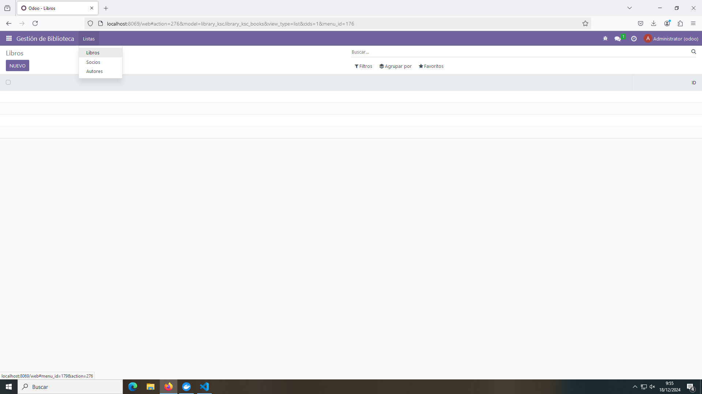
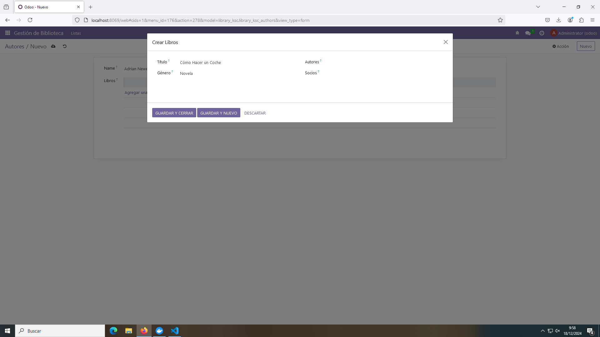
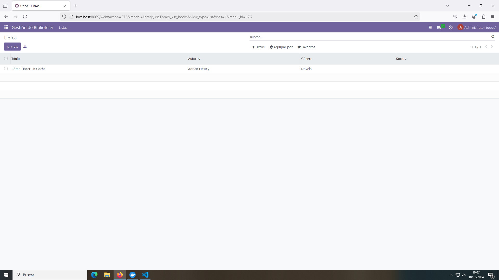
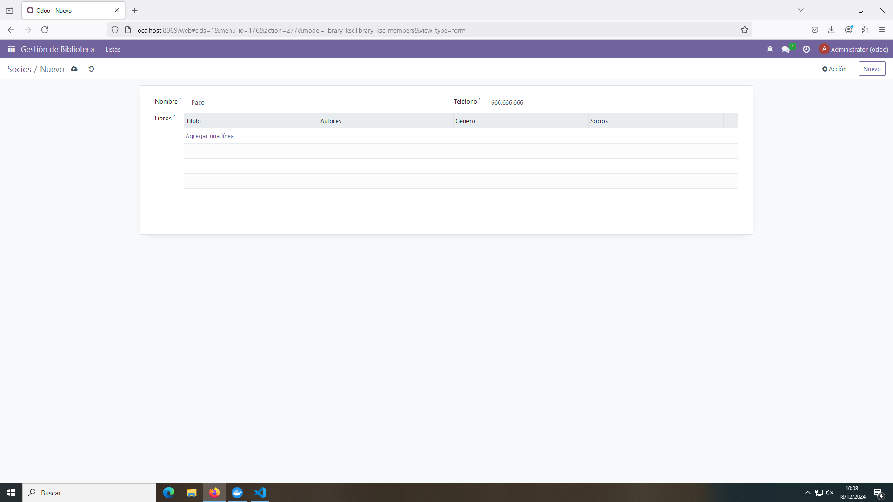
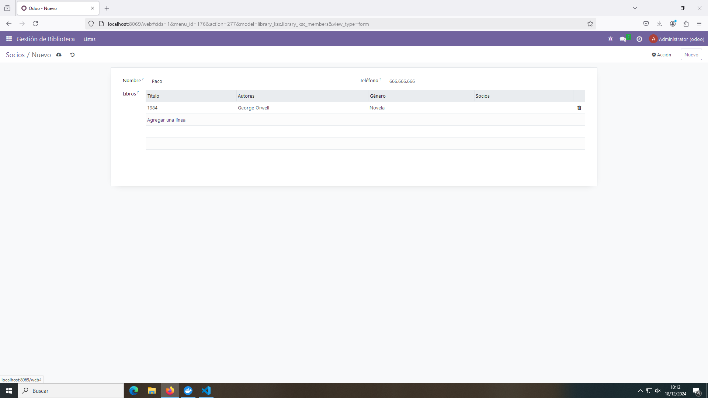
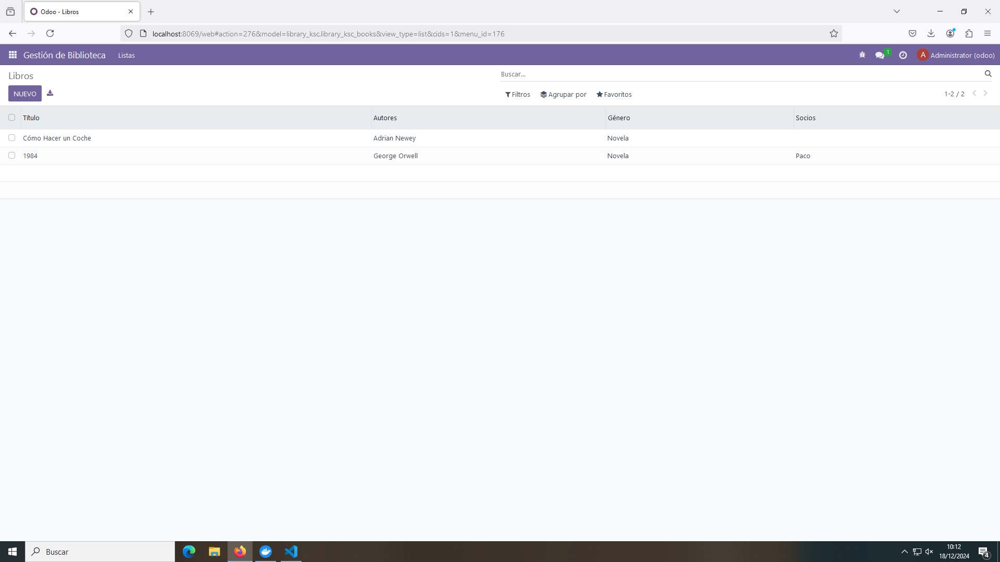

# PR0602: Campos Relacionales - Gestión de Biblioteca

En esta práctica se desarrolla un módulo para la Gestión de una Biblioteca con diferentes campos relacionados entre sí.

## Modelos

- ### Modelo ``library_books``

Este modelo se relaciona con los dos modelos restantes.

```python
# -*- coding: utf-8 -*-

from odoo import models, fields, api


class library_ksc_books(models.Model):
    _name = 'library_ksc.library_ksc_books'
    _description = 'library_ksc.library_ksc'

    title = fields.Char(string = 'Título')
    
    author = fields.Many2one(
        comodel_name = 'library_ksc.library_ksc_authors',
        string = 'Autores'
    )
    genre = fields.Selection(
        selection = [
            ('novela', 'Novela'),
            ('drama', 'Drama'),
            ('ciencia_ficcion', 'Ciencia Ficción'),
            ('misterio', 'Misterio'),
            ('terror', 'Terror'),
            ('historico', 'Histórico')
        ],
        string = 'Género',
        default = 'novela'
    )
    member = fields.Many2one(
        comodel_name = 'library_ksc.library_ksc_members',
        string = 'Socios'
    )
```

- El campo ``author`` se relaciona con el modelo ``library_author`` mediante una relación N:1 o Mucho a Uno. Para esto se define un campo ``Many2one`` con los atributos ``comodel_name`` con el nombre del modelo con el que se relaciona.

- El campo ``member`` es igual que el anterior, pero se relaciona con el modelo ``library_members``.

- ### Modelo ``library_authors``

Este modelo se relaciona con el modelo ``library_books`` anterior.

```python
    # -*- coding: utf-8 -*-

from odoo import models, fields, api


class library_ksc_authors(models.Model):
    _name = 'library_ksc.library_ksc_authors'
    _description = 'library_ksc.library_ksc'

    name = fields.Char()
    country = fields.Many2one(
        comodel_name = 'res.country',
        string = 'País'
    )
    books = fields.One2many(
       comodel_name = 'library_ksc.library_ksc_books',
       inverse_name = 'author',
       string = 'Libros'
    )
```

- El campo ``country`` permite selecionar un país relacionándolo con un campo N:1 con el modelo ``res.country``, que cuenta con países.

- El campo ``books`` está relacionado con el modelo ``library_books``. Su relación es de 1:N, pues en el modelo de libros existe una relación N:1 y es necesario que exista su contraparte.

    El atributo ``comodel_name`` tiene el nombre del modelo con el que se relaciona y el atributo ``inverse_name`` es el nombre del campo al que está apuntando del modelo con el que se relaciona.

    Esta relación se va a mostrar mediante una lista.

- ### Modelo ``library_members``

Este modelo se relaciona con el modelo ``library_books``.

```python
# -*- coding: utf-8 -*-

from odoo import models, fields, api


class library_ksc_members(models.Model):
    _name = 'library_ksc.library_ksc_members'
    _description = 'library_ksc.library_ksc'

    name = fields.Char(string = 'Nombre')
    tele = fields.Integer(string = 'Teléfono')
    books = fields.One2many(
        comodel_name = 'library_ksc.library_ksc_books',
        inverse_name = 'title',
        string = 'Libros'
    )
```

- El campo ``books`` se relaciona con el modelo ``library_books`` de la misma manera que en el modelo de autores.

- ### Archivo init.py

```python
# -*- coding: utf-8 -*-

from . import library_books
from . import library_authors
from . import library_members
```

## Vistas

Las vistas se dividen en cuatro ficheros xml, uno para cada modelo y otro para el menú.

- ### Vista ``library_books_views.xml``

```xml
<odoo>
  <data>
    <!-- explicit list view definition -->

    <record model="ir.ui.view" id="library_ksc.list_books">
      <field name="name">library_ksc list</field>
      <field name="model">library_ksc.library_ksc_books</field>
      <field name="arch" type="xml">
        <tree>
          <field name="title"/>
          <field name="author"/>
          <field name="genre"/>
          <field name="member"/>
        </tree>
      </field>
    </record>

    <!-- actions opening views on models -->

    <record model="ir.actions.act_window" id="library_ksc.books_action_window">
      <field name="name">Libros</field>
      <field name="res_model">library_ksc.library_ksc_books</field>
      <field name="view_mode">tree,form</field>
    </record>
  </data>
</odoo>
```

- ### Vista ``library_authors_views.xml``

```xml
<odoo>
  <data>
    <!-- explicit list view definition -->

    <record model="ir.ui.view" id="library_ksc.list_authors">
      <field name="name">library_ksc list</field>
      <field name="model">library_ksc.library_ksc_authors</field>
      <field name="arch" type="xml">
        <tree>
          <field name="name"/>
          <field name="country"/>
          <field name="books"/>
        </tree>
      </field>
    </record>

    <!-- actions opening views on models -->

    <record model="ir.actions.act_window" id="library_ksc.authors_action_window">
      <field name="name">Autores</field>
      <field name="res_model">library_ksc.library_ksc_authors</field>
      <field name="view_mode">tree,form</field>
    </record>
  </data>
</odoo>
```

- ### Vista ``library_members_views.xml``

```xml
<odoo>
  <data>
    <!-- explicit list view definition -->

    <record model="ir.ui.view" id="library_ksc.list_members">
      <field name="name">library_ksc list</field>
      <field name="model">library_ksc.library_ksc_members</field>
      <field name="arch" type="xml">
        <tree>
          <field name="name"/>
          <field name="tele"/>
          <field name="books"/>
        </tree>
      </field>
    </record>

    <!-- actions opening views on models -->

    <record model="ir.actions.act_window" id="library_ksc.members_action_window">
      <field name="name">Socios</field>
      <field name="res_model">library_ksc.library_ksc_members</field>
      <field name="view_mode">tree,form</field>
    </record>
  </data>
</odoo>
```

- ### Vista ``library_menu_views.xml``

```xml
<odoo>
  <data>
    <!-- Top menu item -->

    <menuitem name="Gestión de Biblioteca" id="library_ksc.menu_root"/>

    <!-- menu categories -->

    <menuitem name="Listas" id="library_ksc.menu_1" parent="library_ksc.menu_root"/>

    <!-- actions -->

    <menuitem name="Libros" id="library_ksc.menu_1_list" parent="library_ksc.menu_1"
              action="library_ksc.books_action_window"/>

    <menuitem name="Socios" id="library_ksc.menu_2_list" parent="library_ksc.menu_1"
              action="library_ksc.members_action_window"/>

    <menuitem name="Autores" id="library_ksc.menu_3_list" parent="library_ksc.menu_1"
              action="library_ksc.authors_action_window"/>
    
  </data>
</odoo>
```

## Archivo seguridad

```csv
id,name,model_id:id,group_id:id,perm_read,perm_write,perm_create,perm_unlink
access_library_ksc_library_ksc_books,library_ksc.library_ksc_books,model_library_ksc_library_ksc_books,base.group_user,1,1,1,1
access_library_ksc_library_ksc_members,library_ksc.library_ksc_members,model_library_ksc_library_ksc_members,base.group_user,1,1,1,1
access_library_ksc_library_ksc_authors,library_ksc.library_ksc_authors,model_library_ksc_library_ksc_authors,base.group_user,1,1,1,1
```

## Archivo manifest.py
```python
# -*- coding: utf-8 -*-
{
    'name': "library_ksc",

    'summary': """
        Short (1 phrase/line) summary of the module's purpose, used as
        subtitle on modules listing or apps.openerp.com""",

    'description': """
        Long description of module's purpose
    """,

    'author': "My Company",
    'website': "https://www.yourcompany.com",

    # Categories can be used to filter modules in modules listing
    # Check https://github.com/odoo/odoo/blob/16.0/odoo/addons/base/data/ir_module_category_data.xml
    # for the full list
    'category': 'Uncategorized',
    'version': '0.1',

    # any module necessary for this one to work correctly
    'depends': ['base'],

    # always loaded
    'data': [
        'security/ir.model.access.csv',
        'views/library_books_views.xml',
        'views/library_members_views.xml',
        'views/library_authors_views.xml',
        'views/library_menu_views.xml'
    ],
    # only loaded in demonstration mode
    'demo': [
        'demo/demo.xml',
    ],
}
```

## Funcionamiento


Estado inicial del módulo. Por defecto se cargará la vista de libros, pero se puede navegar a través de las tres con el menú desplegable.


Introducir un autor. Al clickar **Agregar Línea** se puede añadir directamente el libro.



Introducir un libro desdel el apartado de autores. Se permite porque las tablas están relacionadas.



Libro introducido.



Introducir un socio. Al igual que con los autores, se puede introducir un libro asociado a este socio directamente con el botón **Agregar Línea**.


Introducir un libro desde el apartado de socios.


Resultado.


Libros desde la vista de Libros.

