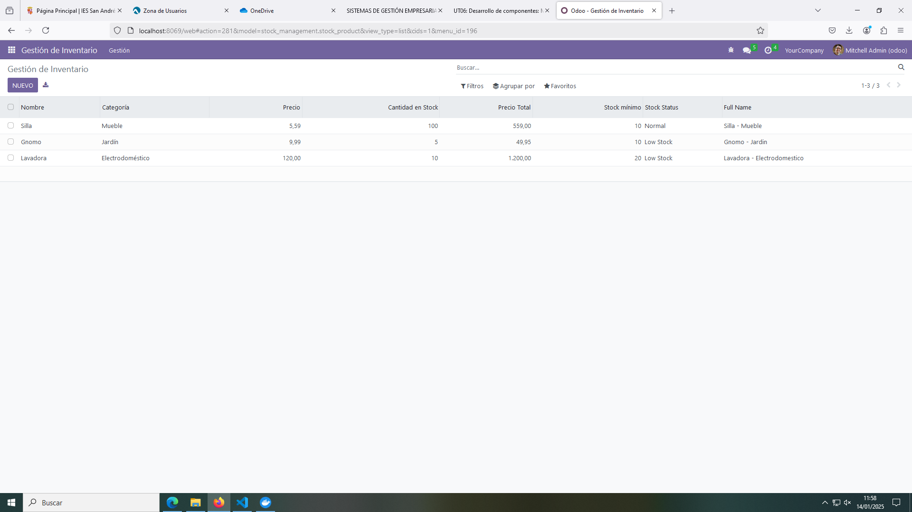
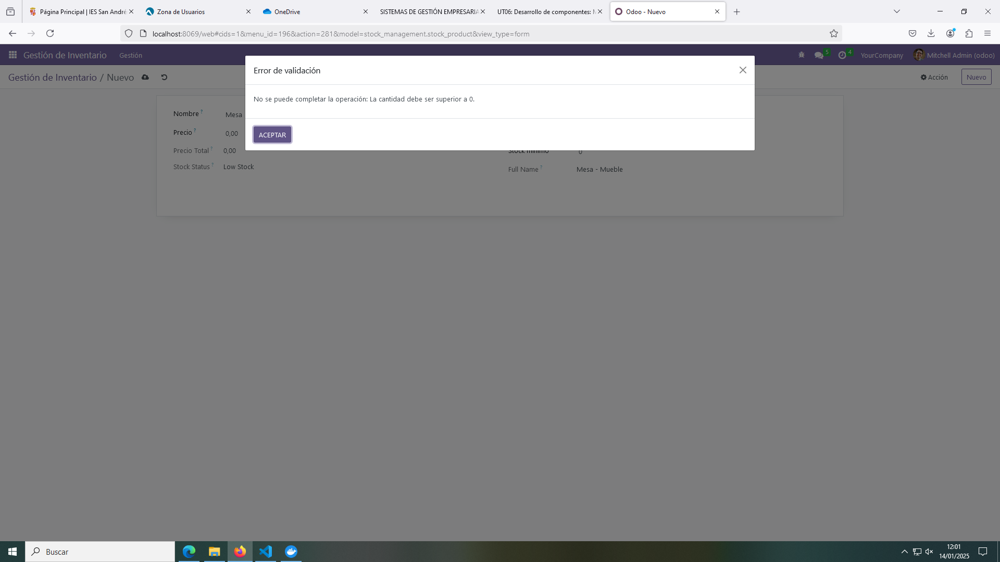

# PR0603: Campos calculados y restricciones - Gestión de Inventario

En esta práctica se desarrolla un módulo para la Gestión de un Inventario con campos calculados y restricciones.

## Modelo product.py

Este archivo tiene los campos calculados y restricciones del módulo.

```python
# -*- coding: utf-8 -*-

from odoo import models, fields, api
from odoo.exceptions import ValidationError

class stock_product(models.Model):
    _name = 'stock_management.stock_product'
    _description = 'stock_management.stock_management'

    name = fields.Char(string = "Nombre")
    category = fields.Selection(
        string = "Categoría",
        selection = [
            ('mueble', 'Mueble'),
            ('jardin', 'Jardín'),
            ('electrodomestico', 'Electrodoméstico')
        ],
        default = 'mueble'
    )
    price = fields.Float(string = "Precio")
    quantity = fields.Integer(string = "Cantidad en Stock")
    total_value = fields.Float(string = "Precio Total", compute="_value_total_value")
    minimum_quantity = fields.Integer(string = "Stock mínimo")
    stock_status = fields.Selection(
        selection = [
            ('normal', 'Normal'),
            ('low', 'Low Stock')
        ],
        compute="_value_stock_status"
    )
    full_name = fields.Char(
        compute="_value_full_name"
        )

    # RESTRICCIONES SQL
    _sql_constraints = [
        ('check_name', 'unique(name)',
         'El nombre debe ser único.'),
        ('check_quantity', 'CHECK(quantity > 0)', 
         'La cantidad debe ser superior a 0.')
    ]

    # RESTRICCIONES PYTHON
    @api.constrains('price')
    def _value_price(self):
        for record in self:
            if record.price < 0:
                raise ValidationError("El precio debe ser mayor a 0.")

    @api.constrains('quantity')
    def _value_quantity(self):
        for record in self:
            if record.quantity < 0:
                raise ValidationError("La cantidad debe ser mayor a 0.")

    @api.constrains('total_value')
    def _check_total_value(self):
        for record in self:
            if record.total_value > 100000:
                raise ValidationError("El valor del stock no puede ser mayor a 100000.")
            
    @api.constrains('category')
    def _value_category(self):
        for record in self:
            if record.category == None:
                raise ValidationError("La categoría no puede estar vacía.")

    # CAMPOS CALCULADOS
    @api.depends('name', 'category')
    def _value_full_name(self):
        for record in self:
            record.full_name = (record.name.capitalize() if record.name else "") + " - " + (record.category.capitalize() if record.category else "")
            # record.full_name = f"{record.name} - {record-category}"

    @api.depends('price', 'quantity')
    def _value_total_value(self):
        for record in self:
            record.total_value += record.price * record.quantity

    @api.depends('quantity', 'minimum_quantity')
    def _value_stock_status(self):
        for record in self:
            if record.quantity > record.minimum_quantity:
                record.stock_status = 'normal'
            else:
                record.stock_status = 'low'
```

## Vista

```xml
<odoo>
  <data>
    <!-- explicit list view definition -->

    <record model="ir.ui.view" id="stock_management.list">
      <field name="name">stock_management list</field>
      <field name="model">stock_management.stock_product</field>
      <field name="arch" type="xml">
        <tree>
          <field name="name"/>
          <field name="category"/>
          <field name="price"/>
          <field name="quantity"/>
          <field name="total_value"/>
          <field name="minimum_quantity"/>
          <field name="stock_status"/>
          <field name="full_name"/>
        </tree>
      </field>
    </record>


    <!-- actions opening views on models -->

    <record model="ir.actions.act_window" id="stock_management.action_window">
      <field name="name">Gestión de Inventario</field>
      <field name="res_model">stock_management.stock_product</field>
      <field name="view_mode">tree,form</field>
    </record>

    <!-- Top menu item -->

    <menuitem name="Gestión de Inventario" id="stock_management.menu_root"/>

    <!-- menu categories -->

    <menuitem name="Gestión" id="stock_management.menu_1" parent="stock_management.menu_root"/>

    <!-- actions -->

    <menuitem name="Inventario" id="stock_management.menu_1_list" parent="stock_management.menu_1"
              action="stock_management.action_window"/>
  
  </data>
</odoo>
```

## Manifest

```python
# -*- coding: utf-8 -*-
{
    'name': "stock_management",

    'summary': """
        Short (1 phrase/line) summary of the module's purpose, used as
        subtitle on modules listing or apps.openerp.com""",

    'description': """
        Long description of module's purpose
    """,

    'author': "My Company",
    'website': "https://www.yourcompany.com",

    # Categories can be used to filter modules in modules listing
    # Check https://github.com/odoo/odoo/blob/16.0/odoo/addons/base/data/ir_module_category_data.xml
    # for the full list
    'category': 'Uncategorized',
    'version': '0.1',

    # any module necessary for this one to work correctly
    'depends': ['base'],

    # always loaded
    'data': [
        'security/ir.model.access.csv',
        'views/views.xml',
        'views/templates.xml',
    ],
    # only loaded in demonstration mode
    'demo': [
        'demo/demo.xml',
    ],
}
```
## Security

```csv
id,name,model_id:id,group_id:id,perm_read,perm_write,perm_create,perm_unlink
access_stock_management_stock_management,stock_management.stock_product,model_stock_management_stock_product,base.group_user,1,1,1,1
```

## Funcionamiento


Módulo con registros introducidos y campos calculados.



Error al intentar introducir un registro con cantidad 0.


Error al intentar introducir un registro con precio negativo.