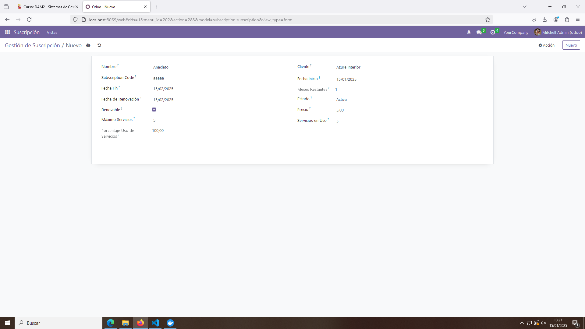
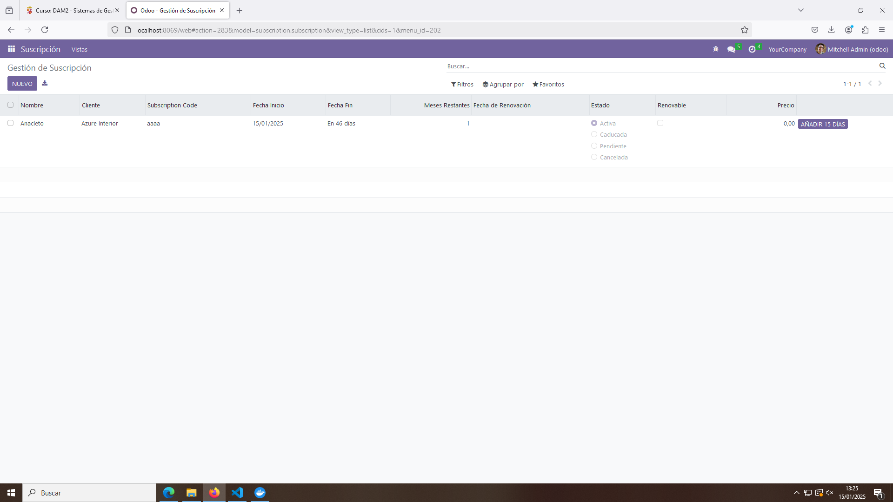
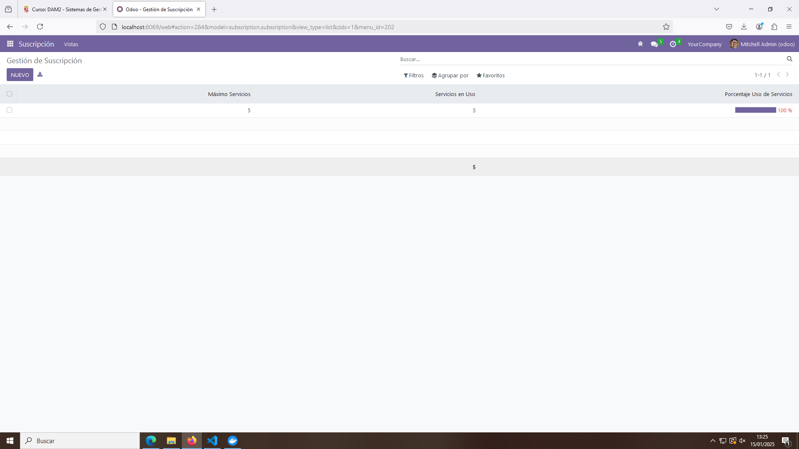

# PR0604: Vista de Tipo Lista - Gestión de Suscripciones

En esta práctica se desarrolla un módulo para la Gestión de Suscripciones con campos calculados y vistas de tipo lista con decoradores, condiciones y widgets.

## Modelo subscription.py

Define los campos y funciones del modelo.

```python
# -*- coding: utf-8 -*-

from odoo import models, fields, api


class subscription(models.Model):
    _name = 'subscription.subscription'
    _description = 'subscription.subscription'

    # Campos Basicos
    name = fields.Char(
        string = 'Nombre',
        required = True)
    customer_id = fields.Many2one(
        comodel_name = 'res.partner',
        string = 'Cliente',
        required = True)
    subscription_code = fields.Char(required = True)
    start_date = fields.Date(string = 'Fecha Inicio',
                             required = True)
    end_date = fields.Date(string = 'Fecha Fin')
    duration_months = fields.Integer(string = 'Meses Restantes', compute="_value_duration_months")
    renewal_date = fields.Date(string = 'Fecha de Renovación')
    status = fields.Selection(
        selection = [('active', 'Activa'),
                     ('expired', 'Caducada'),
                     ('pending', 'Pendiente'),
                     ('cancelled', 'Cancelada')
                     ],
        default = 'active',
        string = 'Estado')
    is_renewable = fields.Boolean(string = 'Renovable')
    price = fields.Float(string = 'Precio')

    # Campos de uso
    usage_limit = fields.Integer(string = 'Máximo Servicios')
    current_usage = fields.Integer(string = 'Servicios en Uso')
    use_percent = fields.Float(string = 'Porcentaje Uso de Servicios', compute="_value_use_percent")

    def add_days(self):
        for sub in self:
            sub.end_date = fields.Date.add(sub.end_date, days=15)

    @api.depends('start_date', 'end_date')
    def _value_duration_months(self):
        for sub in self:
            if sub.start_date and sub.end_date:
                sub.duration_months = (sub.end_date - sub.start_date).days / 30
            else:
                sub.duration_months = 0

    @api.depends('usage_limit', 'current_usage')
    def _value_use_percent(self):
        for sub in self:
            sub.use_percent = (sub.current_usage * 100) / (sub.usage_limit if sub.usage_limit else 1)
```

## Vistas y Menús

### Vista básica

Se muestran los datos catalogados como básicos.

```xml
<odoo>
  <data>
    <!-- explicit list view definition -->

    <record model="ir.ui.view" id="subscription.list_basic">
      <field name="name">subscription list</field>
      <field name="model">subscription.subscription</field>
      <field name="arch" type="xml">
        <tree decoration-danger="status=='expired'" limit="15">
          <field name="name"/>
          <field name="customer_id"/>
          <field name="subscription_code"/>
          <field name="start_date"/>
          <field name="end_date" widget="remaining_days"/>
          <field name="duration_months"/>
          <field name="renewal_date"/>
          <field name="status" widget="radio"/>
          <field name="is_renewable"/>
          <field name="price" attrs="{'invisible': [('status', '==', 'cancelled')]}"/>
          <button 
          name="add_days" 
          type="object"
          string="Añadir 15 días"
          class="btn-primary"/>
        </tree>
      </field>
    </record>
  </data>
</odoo>
```

### Vista de Uso

Se muestran los datos catalogados como de uso.

```xml
<odoo>
  <data>
    <!-- explicit list view definition -->

    <record model="ir.ui.view" id="subscription.list_usage">
      <field name="name">subscription list</field>
      <field name="model">subscription.subscription</field>
      <field name="arch" type="xml">
        <tree limit="15">
          <field name="usage_limit"/>
          <field name="current_usage" avg="1"/>
          <field name="use_percent" 
          decoration-danger="use_percent&gt;=80.0"
          widget="progressbar"/>
        </tree>
      </field>
    </record>
  </data>
</odoo>
```

### Menús

Gestiona los menús y las acciones.

```xml
<odoo>
  <data>
    <!-- actions opening views on models -->

    <record model="ir.actions.act_window" id="subscription.action_window_basic">
      <field name="name">Gestión de Suscripción</field>
      <field name="res_model">subscription.subscription</field>
      <field name="view_mode">tree,form</field>
      <field name="view_id" ref="subscription.list_basic"/>
    </record>

    <record model="ir.actions.act_window" id="subscription.action_window_usage">
      <field name="name">Gestión de Suscripción</field>
      <field name="res_model">subscription.subscription</field>
      <field name="view_mode">tree,form</field>
      <field name="view_id" ref="subscription.list_usage"/>
    </record>


    <!-- Top menu item -->

    <menuitem name="Suscripción" id="subscription.menu_root"/>

    <!-- menu categories -->

    <menuitem name="Vistas" id="subscription.menu_1" parent="subscription.menu_root"/>

    <!-- actions -->

    <menuitem name="Vista Básica" id="subscription.menu_1_list" parent="subscription.menu_1"
              action="subscription.action_window_basic"/>
    
    <menuitem name="Vista de Uso" id="subscription.menu_2_list" parent="subscription.menu_1"
              action="subscription.action_window_usage"/>

  </data>
</odoo>
```

Las vistas utilizan el mismo modelo, aunque muestran diferentes datos.

## Archivo __manifest.py

```python
# -*- coding: utf-8 -*-
{
    'name': "subscription",

    'summary': """
        Short (1 phrase/line) summary of the module's purpose, used as
        subtitle on modules listing or apps.openerp.com""",

    'description': """
        Long description of module's purpose
    """,

    'author': "My Company",
    'website': "https://www.yourcompany.com",

    # Categories can be used to filter modules in modules listing
    # Check https://github.com/odoo/odoo/blob/16.0/odoo/addons/base/data/ir_module_category_data.xml
    # for the full list
    'category': 'Uncategorized',
    'version': '0.1',

    # any module necessary for this one to work correctly
    'depends': ['base'],

    # always loaded
    'data': [
        'security/ir.model.access.csv',
        'views/basic_view.xml',
        'views/usage_view.xml',
        'views/menu_view.xml'
    ]
}
```

## Funcionamiento


Añadiendo un registro.


Vista Básica con un campo registrado (Sin pulsar el botón de añadir 15 días)


Vista Básica con un campo registrado (Pulsando el botón de añadir 15 días)


Vista de Uso con un campo registrado