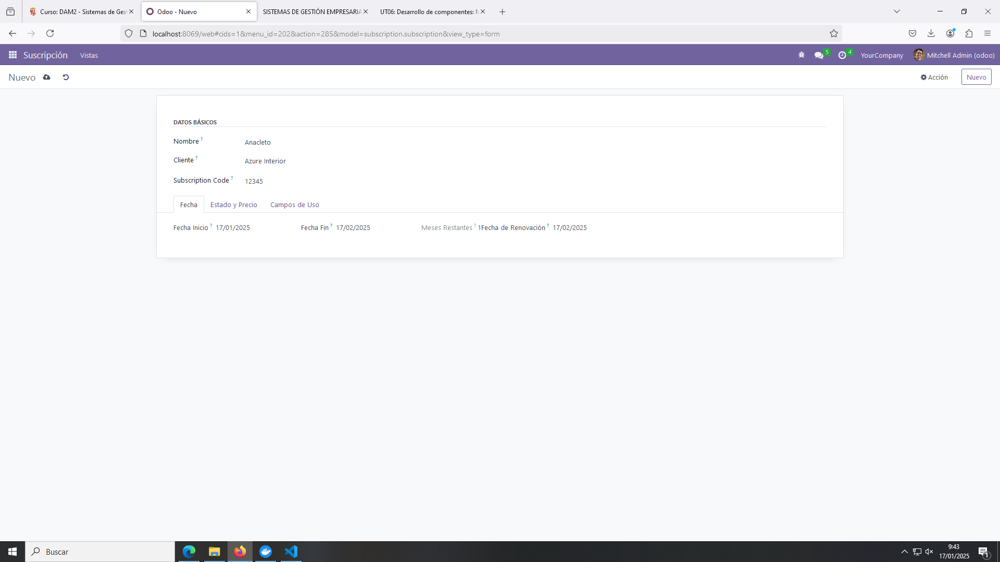
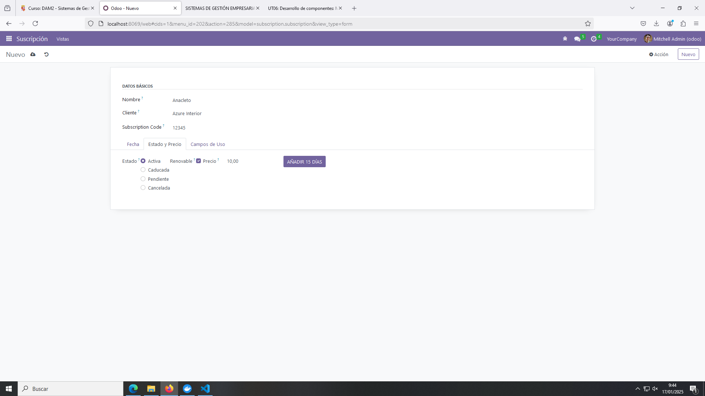
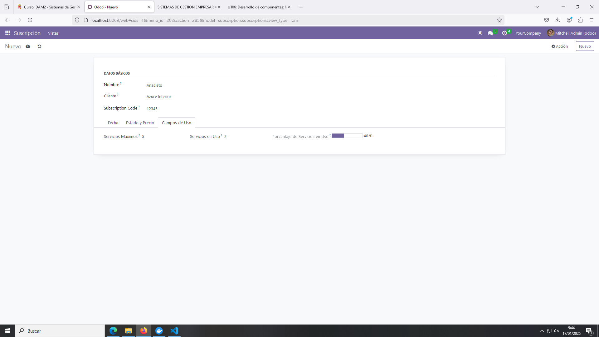

# PR0605: Vista de Tipo Formulario - Gestión de Suscripciones

En esta práctica se desarrolla una vista de formulario para el modelo de Gestión de Suscripciones.

## Archivo form_view.xml

Define una vista de formulario con datos agrupados y datos en un _notebook_.

```xml
<odoo>
  <data>
    <!-- explicit list view definition -->

    <record model="ir.ui.view" id="subscription.form">
      <field name="name">subscription list</field>
      <field name="model">subscription.subscription</field>
      <field name="arch" type="xml">
        <form string='Suscripción'>
            <sheet>
                <group string="Datos Básicos">
                    <!-- <label for="name" string="Nombre"/> -->
                    <field name="name"/>

                    <!-- <label for="customer_id" string="Cliente"/> -->
                    <field name="customer_id"/>

                    <!-- <label for="subscription_code" string="Código de Suscripción"/> -->
                    <field name="subscription_code"/>
                </group>

                <notebook>
                    <page string="Fecha">
                        <label for="start_date" string="Fecha Inicio"/>
                        <field name="start_date"/>

                        <label for="end_date" string="Fecha Fin"/>
                        <field name="end_date" widget="remaining_days"/>

                        <label for="duration_months" string="Meses Restantes"/>
                        <field name="duration_months"/>

                        <label for="renewal_date" string="Fecha de Renovación"/>
                        <field name="renewal_date"/>
                    </page>

                    <page string="Estado y Precio">
                        <label for="status" string="Estado"/>
                        <field name="status" widget="radio"/>

                        <label for="is_renewable" string="Renovable"/>
                        <field name="is_renewable"/>

                        <label for="price" string="Precio"/>
                        <field name="price" attrs="{'invisible': [('status', '==', 'cancelled')]}"/>

                        <button 
                            name="add_days" 
                            type="object"
                            string="Añadir 15 días"
                            class="btn-primary"/>
                    </page>

                    <page string="Campos de Uso">
                        <label for="usage_limit" string="Servicios Máximos"/>
                        <field name="usage_limit"/>

                        <label for="current_usage" string="Servicios en Uso"/>
                        <field name="current_usage"/>

                        <label for="use_percent" string="Porcentaje de Servicios en Uso"/>
                        <field name="use_percent" decoration-danger="use_percent&gt;=80.0"
                            widget="progressbar"/>
                    </page>
                </notebook>
            </sheet>
        </form>
      </field>
    </record>
  </data>
</odoo>
```

## Funcionamiento


Vista con la página de Fechas.


Vista con la página de Estado y Precio.


Vista con la página de Campos de Uso.