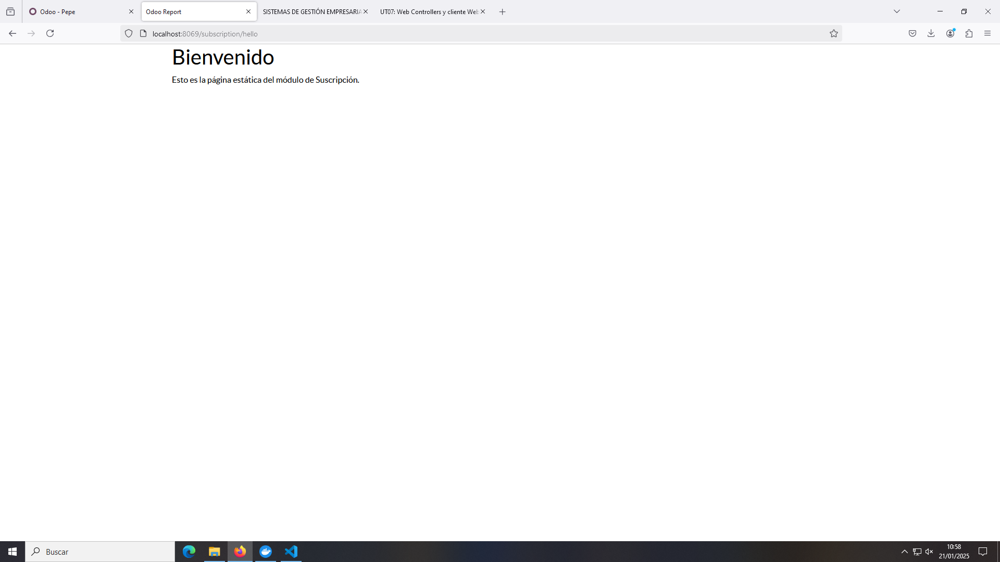

# PR0701: Página estática y dinámica básica

En esta práctica se hace una página estática y dinámica.

## Fichero controllers.py

En este fichero se especfican las funciones para crear las páginas.

```python
# -*- coding: utf-8 -*-
from odoo import http
from odoo.http import request


class Subscription(http.Controller):
    @http.route('/subscription/hello', type='http', auth='public', website=True)
    def hello(self, **kwargs):
        return http.request.render('subscription.static_web', {})


    @http.route('/subscription/list', type='http', auth='public', website=True)
    def subs_list_web(self, **kwargs):
        subs = request.env['subscription.subscription'].search([])
        return http.request.render('subscription.dinamic_web', {
           'subs' : subs
        })
```

## Fichero xml

En este fichero se especifican los valore que van a aparecer en las páginas. Se pueden especificar ambas.

```python
<odoo>
    <template id="static_web" name="Página estática">
        <t t-call="web.html_container">
            <div class="container">
                <h1>Bienvenido</h1>
                <p>Esto es la página estática del módulo de Suscripción.</p>
            </div>
        </t>
    </template>

    <template id="dinamic_web" name="Página dinámica">
        <t t-call="web.html_container">
            <div class="container">
                <h1>Listado de Suscripciones</h1>
                <t t-foreach="subs" t-as="sub">
                    <div class="sub">
                        <span><t t-esc="sub.name"/></span>
                        <span><t t-esc="sub.customer_id"/></span>
                        <span><t t-esc="sub.subscription_code"/></span>
                        <span><t t-esc="sub.status"/></span>
                    </div>
                </t>
            </div>
        </t>
    </template>
</odoo>
```

## Fichero _manifest.py

```python
# -*- coding: utf-8 -*-
{
    'name': "subscription",

    'summary': """
        Short (1 phrase/line) summary of the module's purpose, used as
        subtitle on modules listing or apps.openerp.com""",

    'description': """
        Long description of module's purpose
    """,

    'author': "My Company",
    'website': "https://www.yourcompany.com",

    # Categories can be used to filter modules in modules listing
    # Check https://github.com/odoo/odoo/blob/16.0/odoo/addons/base/data/ir_module_category_data.xml
    # for the full list
    'category': 'Uncategorized',
    'version': '0.1',

    # any module necessary for this one to work correctly
    'depends': ['base'],

    # always loaded
    'data': [
        'security/ir.model.access.csv',
        'views/basic_view.xml',
        'views/usage_view.xml',
        'views/form_view.xml',
        'views/menu_view.xml',
        'views/static_web.xml'
    ]
}
```

## Funcionamiento

### Web estática


Web estática.

http://localhost:8069/subscription/hello

### Web dinámica


En esta captura se ve:
- Nombre del cliente
- Id del cliente según el modelo res.partner (por eso tiene ese formato extraño)
- Id de la suscripción
- Estado de la suscripción

http://localhost:8069/subscription/list